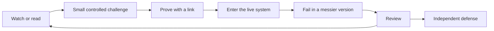

# 00 · The engineer this program is building

*Series: disciplines. The eight kinds of work an engineer does when implementation is cheap. Read this once before The four skills; come back to it when a review confuses you. ~12 minutes.*

## What changed

For most of software history, writing the program took much of the time. Teams valued engineers who could turn requirements into working code quickly. Junior engineers learned by implementing simple changes before taking on harder ones. Code-writing models reduced the cost of that routine work before companies changed their career paths. A senior engineer can now complete some former entry-level tasks in an afternoon with an assistant. As a result, you may be able to build working programs and still find few roles that hire for implementation alone.

Responsibility still requires human judgment. Somebody has to know what the system is for, decide what should change, describe that change precisely enough for a machine or person to execute it, verify the result, and answer for failures. Every one of those acts got more valuable as implementation got cheaper, because a vague instruction that used to waste one engineer's afternoon can now be executed wrong by thirty agents before lunch.

The job postings already say this. Forward Deployed Engineer roles at GitLab and Google in 2026 ask for agent orchestration, context and retrieval systems, evaluation pipelines, observability, ambiguous problem solving, production delivery, and measurable outcomes. Amazon writes "agentic and spec-driven development" into requirements. Microsoft's developer blog argues that the specification has to become the shared source of truth for the code. Cisco engineering leads describe managing ten to twenty agents at once and say the work has moved to architecture, orchestration and asynchronous review. These postings emphasize decisions, coordination, verification, and outcomes.

## The name for it

An **Agentic Systems Engineer** can understand a complex system, define the outcomes and constraints that matter, organize machine and human work around those outcomes, and establish evidence that the result deserves trust. Your first role may use a different title. The capabilities transfer even when employers use different names.

Everything this program grades reduces to four skills, and you will meet them in the next step: Comprehension, Vision, Communication, Verification. Those four skills organize every review. The eight disciplines below describe the work you will do to practice them. The **Map** is the curriculum view that shows your steps, their order, and their prerequisites.

| Discipline | The question it answers | What you will prove |
|---|---|---|
| System comprehension | What actually exists? | You can enter an unfamiliar system and reconstruct how it behaves |
| Context and graph engineering | What must the intelligence have in front of it? | You can represent dependencies, state and knowledge so a machine reasons well |
| Specification engineering | What exactly should become true? | You can turn a vague ask into requirements another person or agent can execute |
| Agentic workflow engineering | How should intelligence execute this? | You can decompose work and direct humans, agents and tools |
| Evaluation engineering | How do we know it worked? | You can build checks that would catch a wrong answer |
| Reliability and systems reasoning | What can go wrong? | You can reason about failure, security, performance and state |
| Product and value engineering | Was this worth building? | You can connect a change to an outcome a user or a business cares about |
| Technical communication and defense | Can others trust the reasoning? | You can explain, be challenged, and defend a decision |

Problem framing has its own reading between comprehension and specification. It practices Vision across these eight disciplines, so the discipline count remains eight.

## Why a live world instead of exercises

Coding exercises test whether you can produce a known answer under a clock, which is work that became cheap. A live multiplayer system tests whether you can enter code you did not write, form an honest model of it, choose a useful change, describe it for another executor, direct the tools, prove the result, and explain your reasoning to a stranger. The program's world has real state, regressions, consequential dependencies, undocumented bugs, and visible effects when someone misunderstands the system. Those properties create the conditions for practice.

Each week should expose a different gap: a system you do not yet understand, an assistant error, a weak specification, or a technically correct change that users do not value. Each gap gives you a place to practice one or more of the eight disciplines.

## The loop you are in

A film introduces a concept, and a small challenge asks you to apply it and provide a link as evidence. You then use the concept in the live system, receive a review, and revise your work. The cycle continues until you can defend the work to an engineer who did not help you. Watching introduces the concept. You complete a step when a stranger can open a URL and see the capability.

## What you can say about yourself afterward

A useful account of your work will be more specific than "completed a program" or "built a multiplayer game." The sentence you can support will be closer to this: you contributed to a continuously operating multiplayer system, mapped a subsystem you had never seen and had the map checked, wrote specifications other people executed without needing you in the room, completed production tasks with agents while recording every intervention, wrote checks that caught real regressions, and defended a change under questioning from an engineer who owed you nothing. Each clause points at a link. That is the credential, and the rest of this series is about earning each clause.

## Do this now (10 minutes)

Open a note. For each of the eight disciplines, write one sentence about the last time you needed it and did not have it. "I shipped a fix I never checked" counts. "I built a feature nobody used" counts. You will reuse this in The four skills, where the same honesty about misses is what makes your examples worth reading.

**Done when** your note contains one specific sentence for each of the eight disciplines.

## What's next

01 · System comprehension: how to enter software you did not write and come out with a model that predicts what it will do.
