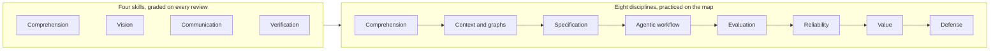
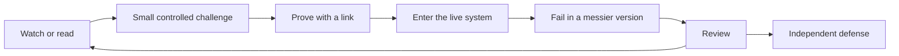

# 00 · The engineer this program is building

*Series: disciplines. The eight kinds of work an engineer does when implementation is cheap. Read this once before The four skills; come back to it when a review confuses you. ~12 minutes.*

## What changed

For most of the history of software the expensive part was typing the program. A team that could turn a requirement into working code faster than another team won, so hiring selected for people who could implement, and the junior rung existed because implementing simple things was how you learned to implement hard ones. Models that write code changed the economics of that rung before anyone changed the ladder. The routine layer that used to be a first job is now something a senior engineer does in an afternoon with an assistant, which is why firms stopped hiring for it, and why you can already build working programs and still be told nobody has a place for you.

What did not get cheaper is responsibility. Somebody still has to know what the system is for, decide what should change, describe that change precisely enough that a machine or a person can execute it, check whether the result is actually right, and answer for it when it is not. Every one of those acts got more valuable as implementation got cheaper, because a vague instruction that used to waste one engineer's afternoon can now be executed wrong by thirty agents before lunch.

The job postings already say this. Forward Deployed Engineer roles at GitLab and Google in 2026 ask for agent orchestration, context and retrieval systems, evaluation pipelines, observability, ambiguous problem solving, production delivery, and measurable outcomes. Amazon writes "agentic and spec-driven development" into requirements. Microsoft's developer blog argues that the specification, not the code, has to become the shared source of truth. Cisco engineering leads describe managing ten to twenty agents at once and say the work has moved to architecture, orchestration and asynchronous review. Nobody in those postings is asking for faster typing.

## The name for it

We call the person those postings describe an **Agentic Systems Engineer**: someone who can understand a complex system, define the outcomes and constraints that matter, organize machine and human work around those outcomes, and establish evidence that the result deserves trust. The title on your first offer will probably say something else, and that is fine. Titles churn; the capability is what transfers.

Everything this program grades reduces to four skills, and you will meet them in the next step: Comprehension, Vision, Communication, Verification. Those four are the control surface. Underneath them sit eight disciplines, which are the actual work you will do to exercise them.

| Discipline | The question it answers | What you will prove |
|---|---|---|
| System comprehension | What actually exists? | You can enter an unfamiliar system and reconstruct how it behaves |
| Context and graph engineering | What must the intelligence have in front of it? | You can represent dependencies, state and knowledge so a machine reasons well |
| Specification engineering | What exactly should become true? | You can turn a vague ask into requirements another person or agent can execute |
| Agentic workflow engineering | How should intelligence execute this? | You can decompose work and direct humans, agents and tools |
| Evaluation engineering | How do we know it worked? | You can build checks that would catch a wrong answer |
| Reliability and systems reasoning | What can go wrong? | You can reason about failure, security, performance and state |
| Product and value engineering | Was this worth building? | You can connect a change to an outcome a user or a business cares about |
| Technical communication and defense | Can others trust the reasoning? | You can explain, be challenged, and defend a decision |

## Why a live world instead of exercises

Coding exercises test whether you can produce a known answer under a clock, which is precisely the thing that got cheap. A live multiplayer system that other people are standing in tests something else: whether you can enter code you did not write, form an honest model of it, choose a change that matters, describe it so it can be executed, direct the tools, prove the result, and explain yourself to a stranger afterward. The world this program runs has real state, real regressions, dependencies that bite, bugs that were never documented, and consequences when someone misunderstands it. Those properties are the curriculum. Every week you should meet something you do not understand, something an assistant gets wrong, something the team specified poorly, and something that works technically and nobody cares about, because each of those is one of the eight disciplines being trained on you.

## The loop you are in

A film gives you a concept. A small challenge asks you to use it. You prove it with a link. Then you take it into the live system, where it fails in a messier form, and you get reviewed, and you go again, until you can defend the whole thing live in front of an engineer who did not help you. You are not done with a step because you watched something. You are done when a stranger can open a URL and see the capability.

## What you can say about yourself afterward

Not "completed a program." Not "built a multiplayer game." The sentence that will be true is closer to this: you contributed to a continuously operating multiplayer system, mapped a subsystem you had never seen and had the map checked, wrote specifications other people executed without needing you in the room, completed production tasks with agents while recording every intervention, wrote checks that caught real regressions, and defended a change under questioning from an engineer who owed you nothing. Each clause points at a link. That is the credential, and the rest of this series is about earning each clause.

## Do this now (10 minutes)

Open a note. For each of the eight disciplines, write one sentence about the last time you needed it and did not have it. "I shipped a fix I never checked" counts. "I built a feature nobody used" counts. You will reuse this in The four skills, where the same honesty about misses is what makes your examples worth reading.

## What's next

01 · System comprehension: how to enter software you did not write and come out with a model that predicts what it will do.
