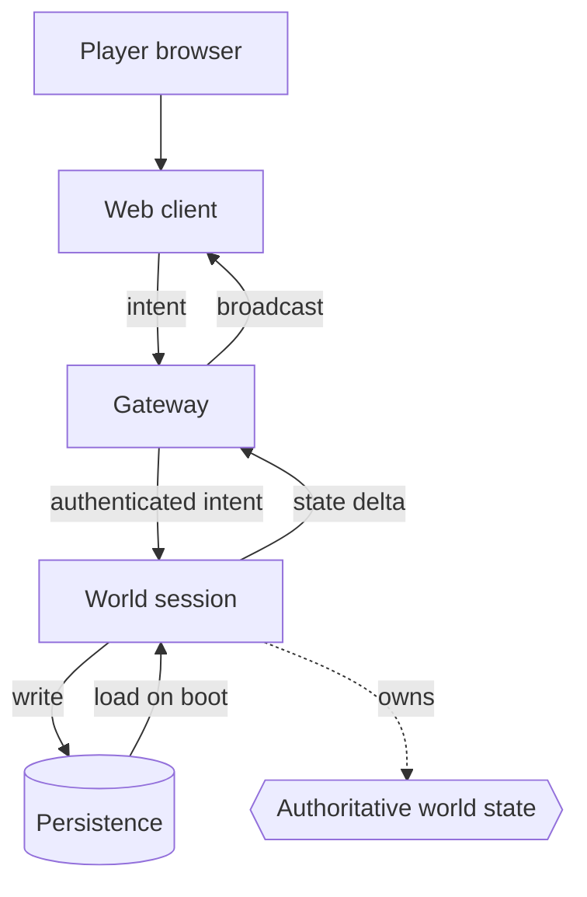

# 01 · System comprehension

*Series: disciplines. How to enter software you did not write and come out with a model that predicts its behaviour. Read before You can read a system. ~14 minutes.*

## Build a system model first

When an engineer joins a system, the instinct is to open the editor and start changing things, because changing things feels like progress and reading feels like delay. Every discipline in this series depends on you reversing that instinct once. Your first artifact in any unfamiliar system is a model: a description of what exists, where authority lives, how state moves, and what must stay true. Code comes after, and only after, because a change made without a model is a guess with a commit message.

This is the discipline the review scores as Comprehension, and it is the one an assistant can fake most convincingly. Ask a model to explain a codebase and it will produce a fluent, confident, structured explanation in eight seconds. The explanation will mix accurate claims with unsupported ones. Until you verify those claims, neither you nor the person reading your pull request can tell which parts are reliable. The pass condition requires your model to predict what the system does. A clear explanation alone cannot establish that result.

## What a system model contains

Whatever the system, you are trying to reconstruct the same twelve things. You will not get all twelve on day one and you should say which ones you do not have.

| Layer | The question | Example answer in a multiplayer world |
|---|---|---|
| Runtime boundaries | What processes exist? | Browser client, gateway, world session, persistence |
| Services | What does each one do? | Gateway authenticates and routes; world session owns the tick loop |
| State ownership | Who is allowed to change each piece of state? | Server owns position; client only proposes |
| Persistence | What survives a restart? | Inventory yes, position every 30 seconds, chat no |
| Event flow | What happens, in order, when X occurs? | Click, intent message, server validation, broadcast, render |
| Network | What crosses which wire, in which format? | WebSocket frames, JSON, one channel per session |
| Dependencies | What does each part need to exist first? | World session needs the plot registry loaded |
| Invariants | What must always be true? | No two players own the same plot |
| Failure surfaces | Where does it break? | Reconnect mid-transaction; gateway restart |
| Authorization | Who may do what? | Only the plot owner can place a structure |
| Deployment | How does code reach production? | Push to main, image build, rolling restart |
| Observability | How do you know what happened? | Server log per tick, no client telemetry yet |

The diagram is the cheap part. The value is in the labels on the arrows and the sentence under it that says who owns the truth.

## The test that separates a model from a summary

Once you have a model, you check it against reality with counterfactuals: questions the system's behaviour will answer whether or not your model does.

- What happens if two players claim the same plot in the same tick?
- Where is the authority over a player's position, and what happens if the client lies?
- What happens when the world server dies halfway through an inventory transaction?
- Which state is eventually consistent, and how long is eventually?
- What, exactly, prevents an item from being duplicated?

Write your answer before you look. Then look. Where you were wrong, your model was wrong, and you have found the exact place to read more carefully. Where you were right, you have earned the confidence you now have. This is the difference between a model and a summary: a summary describes, a model predicts, and only predictions can be wrong.

## Progressively less documentation

The eight-week intensive gives you a documented map of the world for your first change. The documentation gets thinner on purpose as you go. By the time you reach an owned system, you have the code and the logs. In the live world you may have a bug report and a stranger's commit history. The thinning is the training. Comprehension grows when the system in front of you does not explain itself.

Three habits make the thin end survivable:

1. **Read the entry points first.** Where does a request enter? Where does the tick start? Trace one path end to end before you read anything else.
2. **Find the owner of every noun.** For each piece of state you meet, write down which process may change it. Most real bugs are two processes that both think they own something.
3. **Record confidence with every claim.** "Gateway validates the token: sure, read it." "World session retries writes: guess, have not found it." A model with honest confidence is worth more than a longer one without.

## Where the assistant belongs

After the map exists, use it. On You can read a system, draw your paper map before using an assistant. A fluent summary of code you have not read can create confidence without understanding, and you may act on that confidence. Once the map exists, ask it to list the files that touch a symbol, to summarise a module you have already skimmed, to propose invariants for you to check. Treat its explanation of the system as a hypothesis that you still need to test. When a reviewer asks how you know, "the assistant said so" is the answer that fails the step, and it fails for the right reason: nobody was in control.

Use a scorecard to compare your model with the assistant. Ask the assistant the same counterfactual questions you answered from your map, write both sets of answers, and check every disagreement against the code. When your answer is correct, record where the assistant's confidence exceeded its evidence. When the assistant is correct, update the gap in your model. When both answers are wrong, identify the shared assumption that caused the error. Keep the scorecard because the step requires it. By the third ticket, the record should show your recurring errors and the assistant's, which gives you evidence for deciding when to trust either one.

## Do this now (25 minutes)

Pick any codebase you have not read: a dependency you use, an open source project, the world repo if you have access. Set a 25 minute timer.

1. Trace one request or one event from entry to storage. Write the path as a numbered list.
2. Name every piece of state you met and who owns it.
3. Write three invariants you believe hold.
4. Write two counterfactual questions and your predicted answers, with confidence for each.
5. Check one of the predictions against the code or by running it.
6. Ask an assistant the same two questions, paste only the code they touch, and score its answers against yours.

Keep the note. In You can read a system you will do this against the world map for real, and the first ten minutes will already feel familiar.

**Done when** you can hand your note to someone who has never seen the system and they can predict, from your note alone, what happens in one failure case you did not write down.

## What's next

02 · Context and graph engineering: the same model, drawn so that a machine can use it.
