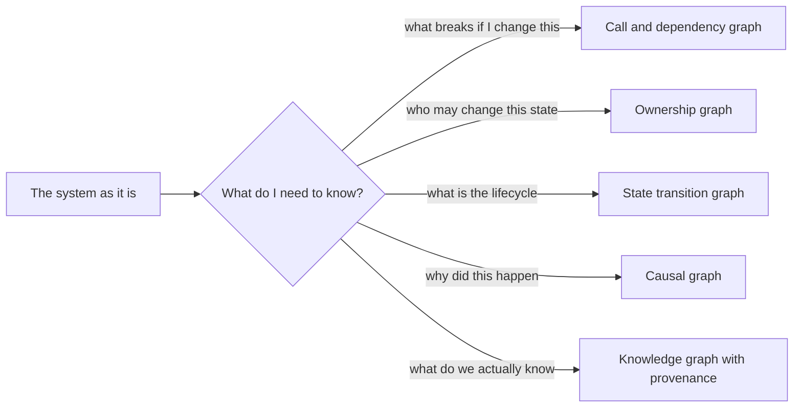

# 02 · Context and graph engineering

*Series: disciplines. How to represent a system so that a person or a model can reason over it without rediscovering it. Read alongside the nanograph series. ~12 minutes.*

## The question underneath graphs

A graph is nodes and edges, and if you stop there you have learned a data structure. The discipline is the question the data structure answers: **how do you represent reality so that intelligence, yours or a machine's, can reason over it efficiently and be right?** Every context window, every retrieval index, every architecture diagram, and every ticket board is an answer to that question, and most of them are bad answers because nobody asked it out loud.

You met the mechanics in the nanograph series, where you built a small typed graph and asked it questions. This reading is about what to put in one and why, so that when an assistant reads your world and produces nonsense, you can say exactly which edge was missing.

## The graphs an engineer actually draws

| Graph | Nodes | Edges mean | When it earns its keep |
|---|---|---|---|
| Call graph | functions | A calls B | Blast radius before a change |
| Dependency graph | modules, packages | A imports or needs B | Build order, coupling, cycles |
| State transition graph | states | event moves A to B | Anything with a lifecycle: orders, sessions, tickets |
| Ownership graph | components, data | A is authoritative for B | Concurrency and authority bugs |
| Causal graph | observations, causes | A produces B | Debugging, product experiments |
| Knowledge graph | claims, entities | A supports, contradicts, cites B | Research, provenance, keeping an assistant honest |
| User journey graph | screens, moments | user moves from A to B | Onboarding, retention work |
| Requirement dependency graph | requirements | A must be true before B | Specification and sequencing |
| Agent execution graph | tasks | A must finish before B, or A reviews B | Orchestrating machine work |

Notice that the same system gives rise to all nine, and each one answers questions the others cannot. A call graph will not tell you who owns a player's position. An ownership graph will not tell you what breaks if you rename a function. Choosing the graph is choosing the question.

## What an edge is worth

Every edge carries three things or it is decoration:

1. **A type.** "Depends on" and "calls" and "owns" are different relations and a graph that flattens them lies.
2. **Provenance.** Where did this edge come from? A parser that read the code is one tier of evidence; a grep that matched a string is a weaker tier; a language server that resolved the symbol is a stronger one; a human who typed it in is whatever that human is worth. When you cannot say where an edge came from, you cannot say how much to trust a conclusion drawn through it.
3. **Freshness.** Code moves. An edge that was true in March and nobody re-derived is a rumour. Stale knowledge does not degrade gracefully; it corrupts reasoning silently, because the reasoning is still valid and only the premises are wrong.

The graph tool you meet in Who calls what labels every edge with its tier and its scan age for exactly this reason. Read those labels. A "possibly affected" from a grep hit and a "definitely affected" from a resolved symbol should change what you do next.

## Context is a graph you hand to a model

When you paste files into an assistant's window, you are constructing a graph and not saying so: this file is relevant, this one is not, these are related. Most bad assistant output is a bad graph. Too much context and the model averages over noise; too little and it invents the missing piece; the wrong slice and it reasons perfectly about a system that does not exist.

Context engineering is doing that construction deliberately:

- **Start from the question**, then pull the neighbourhood the question touches, not the whole repository.
- **Include the invariants** the model must not violate, stated as sentences, near the top.
- **Include the provenance** of anything uncertain. "This may retry; I have not confirmed" is a sentence the model can reason with. Silence is a sentence it will fill in.
- **Exclude what you have not verified** unless you label it. Contaminated context produces confident wrongness.
- **Refresh** when the code moved. Yesterday's slice is a rumour.

The hiring market names this explicitly. GitLab's 2026 Forward Deployed Engineer posting lists graph-based retrieval, repository understanding and context optimisation alongside agent orchestration. That is this reading, as a job.

## When a graph does not help

A graph is worth building when the questions are structural and repeated. It is not worth building when you will ask once, when the system is small enough to hold in your head, or when the relation you care about is fuzzy enough that any edge would be a guess dressed as a fact. Part of this discipline is declining to draw the graph and saying why.

## Do this now (20 minutes)

Take the note from System comprehension.

1. Pick the one question you most wanted answered about that system.
2. Choose the graph type from the table that answers it. Write one sentence justifying the choice.
3. Draw it, in Mermaid or on paper, with no more than twelve nodes. Type every edge.
4. For three edges, write down the provenance: read it, grepped it, guessed it.
5. Paste the graph and the question into an assistant and ask the question. Note where its answer depended on an edge you had marked as a guess.

## Done when

You can look at a wrong assistant answer and point at the edge that was missing, stale or untyped.

## What's next

03 · Problem framing: before you specify anything, be sure you have the problem and not the symptom.
