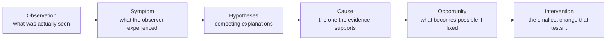

# 03 · Problem framing

*Series: disciplines. Observation, symptom, hypothesis, cause, opportunity, intervention, in that order, and why skipping one costs you the week. Read before You found the real problem. ~11 minutes.*

## The chain you are not allowed to skip

A player writes "movement feels laggy." A product owner writes "add trading." A dashboard shows new players not returning after their first session. All three arrive as requests for action, and the untrained response to all three is to act. The trained response is to walk a chain, one link at a time, and refuse to move to the next link until the current one is written down.

**Observation** is the raw fact. Three players used the word "laggy" in chat on Tuesday. Retention at day seven is eighteen percent. Nobody has traded because there is no trading. An observation is something you could show to a stranger and they would agree it happened.

**Symptom** is what the observer experienced, in their words, without your interpretation. "Movement feels laggy" is a symptom. It is not a cause and it is not a ticket.

**Hypotheses**, plural, are the explanations that could produce the symptom. Laggy movement could be network round trip, server tick rate, client interpolation, a garbage collection pause, an overloaded region, or a keyboard handler that fires late. You are required to write more than one. A single hypothesis is a conclusion wearing a disguise.

**Cause** is the hypothesis that survives the evidence. You get here by gathering something: a log, a trace, a measurement, a question to a user, a reproduction. You do not get here by preferring the hypothesis you already know how to fix.

**Opportunity** is what changes for the user or the system if the cause is removed. Sometimes the honest answer is "very little," and then the intervention is to do nothing and say so.

**Intervention** is the smallest change that would test whether removing the cause removes the symptom. It is the last link, and the only one anyone ever wanted to start with.

## Why immediate coding is penalised

In the founding review sheet, a change that skips from symptom to intervention loses Vision points even if the code works, because the review is scoring whether you were in control, and a person who fixed the first thing they thought of was not. This is deliberate training against the strongest habit engineers have, and it is the habit that assistants amplify most: give a model a symptom and it will propose an intervention in one breath, fluent and plausible and untested. Your job is to insert the four links it skipped.

## The request that is not the problem

"Add trading" is the hardest case because it arrives as an intervention with no observation attached. When a request arrives at the wrong end of the chain, walk it backward. Why trading? Because players say the game is lonely. Is that observed, or assumed? Three said it in chat; nobody asked the others. What else could produce "lonely"? Empty spawn areas, no way to find other players, no reason to interact. Now trading is one hypothesis among four, and you can compare them on evidence and cost instead of building the one that was shouted loudest.

The framing that comes out of this is a short document, and it is the artifact the You found the real problem step asks you to link:

| Field | Contents |
|---|---|
| Observation | The fact, with where and when you saw it |
| Symptom | What the observer said or felt, quoted |
| Hypotheses | At least three, each one sentence |
| Evidence gathered | What you looked at and what it showed |
| Cause | The surviving hypothesis, with confidence |
| Opportunity | What changes if it is fixed, for whom, how you would know |
| Proposed intervention | The smallest test, not the full solution |
| Not doing | The hypotheses you set aside and why |

## Framing on a live world

The world you work in ships with problems that were never written down. That is the point. When a step says "find the highest-value problem," the deliverable is the table above, and the judgment being tested is whether you can tell an annoyance from an opportunity. A stuck door that one player hit once is an observation. Forty percent of first sessions ending inside three minutes is a symptom with a business attached to it. Learn to tell the size of the thing before you decide how much of your week it deserves.

## Do this now (20 minutes)

Take one of these and walk the full chain in writing.

- A real complaint from software you use: something you have said "this is annoying" about this week.
- "New players are not coming back after their first session."
- "Make search better."

Write three or more hypotheses. For each, write the single cheapest piece of evidence that would raise or lower your confidence in it. Pick the one you would gather first and say why. Do not write the fix.

## Done when

Someone can read your framing, disagree with your chosen cause, and point to the exact evidence that would settle it. If they cannot disagree, you have not framed; you have decided.

## What's next

04 · Specification engineering: turning the surviving hypothesis into a contract someone else can execute without you in the room.
