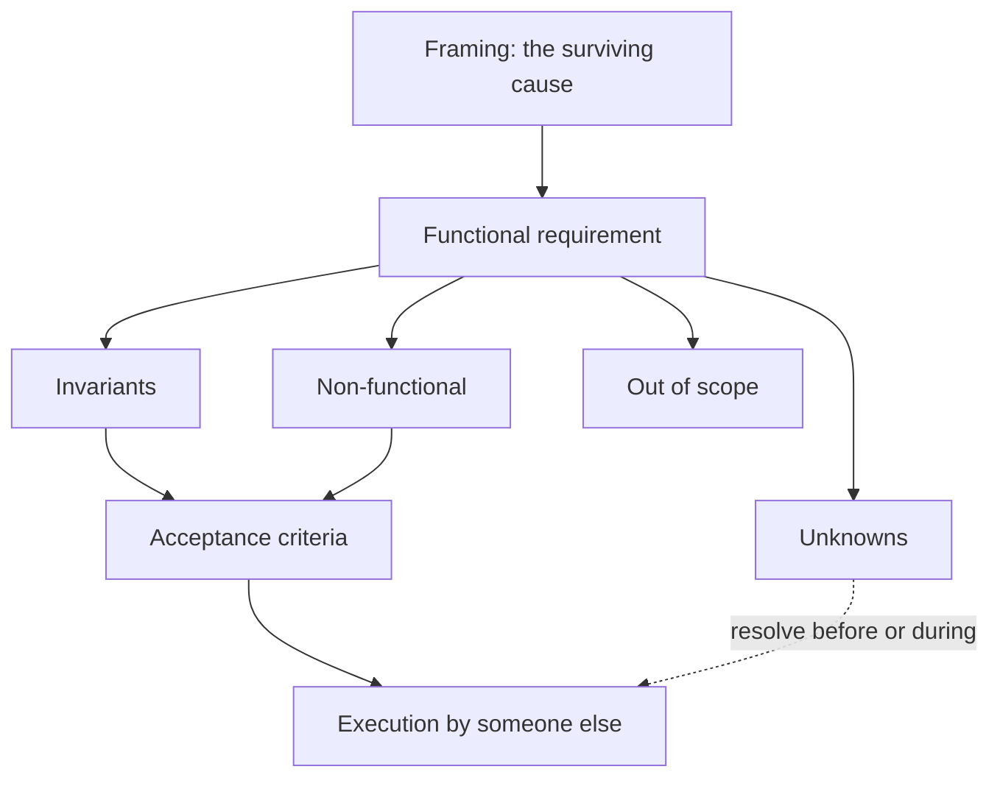

# 04 · Specification engineering

*Series: disciplines. How to write a change so that another person or an agent can execute it without asking you anything. Read before Someone else can build it. ~13 minutes.*

## The economics that make this matter now

A vague ticket used to waste some of one engineer's day. The engineer would read it, guess, ask a question in chat, wait, guess again, and eventually ship something close to what was meant. The cost was annoying and bounded. Hand the same ticket to thirty agents and the cost is neither. They will not ask. They will each pick a plausible reading and execute it with total confidence, and you will spend the week discovering which of thirty wrong things you now own. Microsoft's developer platform team wrote this up as spec-driven development in 2026: when implementation is cheap, translation loss between intent and code becomes the dominant failure, and the specification has to become the shared source of truth that requirements, design, implementation and validation all point at.

That is why this is one of the largest disciplines in the program, and why the pass condition is unusual: your specification passes when someone who cannot talk to you executes it and does not need to.

## Two sentences

> Add trading.

> Allow two authenticated players within interaction distance to exchange mutually accepted inventory items atomically, with no duplication or loss, even if either client disconnects during confirmation.

The second sentence is not longer for the sake of length. Every clause closes a door that the first sentence left open, and each open door is a place an executor would have had to guess. Authenticated: no trading from a spoofed session. Within interaction distance: no cross-map trades. Mutually accepted: both confirm. Atomically: both sides move or neither does. No duplication or loss: the invariant. Even if a client disconnects: the failure case that will otherwise be discovered in production.

## The parts of a specification

| Part | The question it answers | Trading example |
|---|---|---|
| Functional requirement | What should happen? | Two players can propose, review and confirm an exchange of items |
| Invariants | What must always remain true? | Total item count across both inventories is unchanged by any trade; an item has exactly one owner at any instant |
| Non-functional requirements | How well? | Confirmation round trip under 300 ms at the 95th percentile; works on mobile viewport |
| Acceptance criteria | What observable conditions establish success? | Given A and B adjacent, when both confirm, then both inventories reflect the swap after a server restart |
| Unknowns | What still needs investigation? | Whether the current inventory write is transactional; how "adjacent" is computed today |
| Out of scope | What are we deliberately not solving? | Currency, trade history UI, trading with offline players |

Acceptance criteria are where most specifications fail. "Trading works" is not observable. "Given, when, then" is, and it is also the sentence a test will be written from, which means writing it well does half of Evaluation engineering before you start.

## Invariants are the load-bearing part

A functional requirement says what should happen on the good path. An invariant says what must stay true on every path, including the ones nobody thought of. Executors, human or machine, will implement the good path you described and improvise the rest. The invariant is the only thing standing between their improvisation and a duplicated item. Write invariants as sentences a test could check, and write them before the requirement if you can, because the requirement often changes once you see what it must not break.

## Unknowns are not weakness

A specification with an empty unknowns section was written by someone who did not look. Listing what you have not confirmed is what lets an executor stop at the right moment and ask, instead of guessing past it. It is also where your Comprehension calibration shows: an unknown you named and later resolved is evidence you knew the edge of your own model.

## The test

Founding runs the same test on your spec that the world will run on your work. Another student, or an agent, receives your specification without access to you. They attempt to execute it. Every time they need to ask something, that is a clarification, and the count is recorded. Two clarifications on a real specification is excellent. Fourteen means the document was a wish. Over the program you will see your own number fall, and that falling number is the metric the review sheet calls clarification debt.

Before you hand a spec over, run the test on yourself. Read it as a stranger. At every sentence ask: could I execute this without asking? If the answer is "I would assume," write down the assumption as a requirement or as an unknown. Assumptions that stay in your head are the ones that get executed wrong.

## Specifications for agents specifically

Agents read exactly what you wrote and nothing you meant. This is a gift, because it makes the test above cheap to run. Give an assistant your spec and the invariants and ask it to list every decision it would have to make that the document does not settle. It will find your gaps faster than a colleague will, and it will not be polite about it.

## Do this now (30 minutes)

Take the framing from Problem framing, or "make search better" if you skipped it.

1. Write the six parts. Be strict about acceptance criteria: given, when, then.
2. Write at least two invariants as testable sentences.
3. Hand it to an assistant with the instruction: "List every decision you would have to make to implement this that the document does not settle. Do not implement." Count the list.
4. Revise until the list is under three, or until the remaining items are honestly in Unknowns.

## Done when

A stranger, or a model, can produce the acceptance tests from your document alone, and they match the tests you had in mind.

## What's next

05 · Agentic workflow engineering: now that the contract is precise, who and what executes it, in what order, with what checkpoints.
