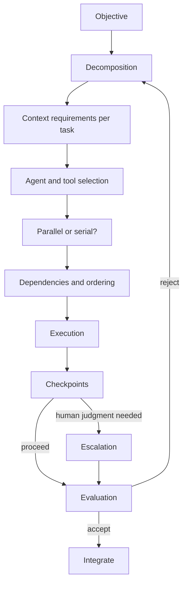

# 05 · Agentic workflow engineering

*Series: disciplines. Decomposing a change, choosing what runs in parallel, deciding where a human must stand, and recording every intervention. Read before You ran the agents. ~14 minutes.*

## What replaced "development workflow"

The old workflow module taught you to branch, commit, open a pull request and merge. Those mechanics still exist and you used them on Your first ticket. What they no longer describe is the shape of the work, because you are no longer the only thing executing. Cisco engineering leads in 2026 describe managing ten to twenty agents at once, and describe their own job as architecture, orchestration and asynchronous review. That is the workflow this discipline teaches, and it starts with a chain that looks nothing like a commit log.

Every box is a decision you make and record. The record is the deliverable.

## Decomposition

A specification describes a state of the world. Decomposition turns it into tasks small enough that each one can be executed, checked and rejected independently. A task that cannot be rejected on its own is too large. A task that needs the output of every other task before it can be checked is in the wrong place in the order.

Three questions per task:

- **What context does this task need and no more?** The whole repository is never the answer. Give the slice that the task touches plus the invariants. Extra context costs twice: the tokens, and the irrelevant patterns a model finds in it to imitate.
- **What could this task break that is outside itself?** That is the blast radius you named on You can read a system, and it decides whether the task can run alongside others.
- **How will I know it is done?** If the answer is "I will look at it," write down what you will look for. If the answer is a test, name the test.

## Parallel or serial

Two tasks can run at the same time when neither needs the other's output and neither touches state the other touches. Everything else is serial, and pretending otherwise is how you get two agents editing the same file with different assumptions. The honest default for a beginner is serial, then parallelise the pairs you can prove are independent. The dishonest default is to launch everything at once and call the resulting merge conflicts "iteration."

When one agent reviews another's output, that is a serial dependency with a specific purpose: catching the class of error the first agent is blind to. It is useful when the review criteria are written down. It is theatre when they are not, because a model asked to "review this" will find something to say regardless.

## Where a human must stand

Autonomy is a setting, and the setting should match the consequence of being wrong. Before you delegate, write down where the machine must stop and wait for you:

| Boundary | Machine may | Machine must stop and ask |
|---|---|---|
| Scope | Edit files inside the task's slice | Touch anything outside it |
| Data | Read production logs | Write to production state |
| Ambiguity | Resolve a choice the spec settles | Resolve a choice the spec lists as unknown |
| Cost | Spend the agreed budget | Exceed it |
| Confidence | Proceed on a verified premise | Proceed on a premise it inferred |

These are checkpoints. An agent that passes a checkpoint without stopping is a finding, and it goes in your record.

## The intervention record

Every time you step in, you write it down. What the agent did, why you stopped it, what you changed, what you told it. That record is the only evidence that a human was in control, and it produces the metric the program tracks as **intervention rate**: useful completed outcome divided by human interventions. Early on you might intervene seventeen times on one task. Later it might be three. The number falling is only good news if the quality of the result held; a falling intervention count with rising defects means you learned to look away, which is the failure this discipline exists to prevent.

The record also answers the question employers are beginning to ask and cannot yet answer: what did the human contribute? Your intervention log is that answer, per task, with timestamps.

## When not to use another agent

Sometimes the correct orchestration is one model call. Sometimes it is you, typing, for eleven minutes. A five-agent graph that produces a worse result than a single well-contexted prompt is cost wearing the look of sophistication. Part of this discipline is running the same specification through one agent and through several, measuring completion, correctness, cost, elapsed time, interventions, context consumed and regressions, and discovering that more machine was not more progress. Founding does this once on purpose, in You ran the agents, so you have the experience before a job asks you to have the opinion.

## Cost and latency are requirements

Token spend and wall-clock time are part of the specification whether you wrote them down or not. An agentic workflow that solves the task for forty dollars when a colleague solved it for two has failed a non-functional requirement. Record both. You will be asked for them.

## Do this now (30 minutes)

Take the specification from Specification engineering.

1. Decompose it into no more than six tasks. For each, one line of context needed, one line of what it could break, one line of how you would know it is done.
2. Mark which tasks may run in parallel and justify each pair.
3. Write the human boundary table for this change.
4. Execute the first task with an assistant. Keep a running note: every time you intervene, one line saying what and why.
5. At the end, count the interventions and write one sentence about whether each was the spec's fault, the agent's fault, or yours.

## Done when

Someone can read your decomposition and intervention log and reconstruct, without talking to you, what the machine did and what you did.

## What's next

06 · Evaluation engineering: "tests passed" is not "correct," and what to build instead.
