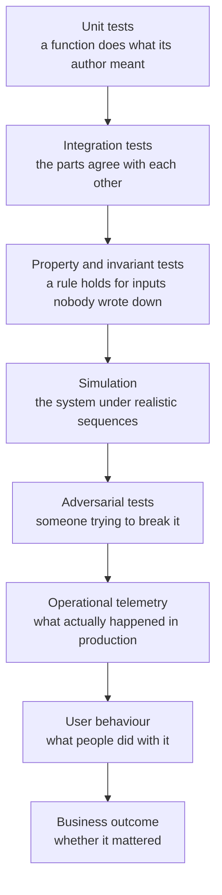

# 06 · Evaluation engineering

*Series: disciplines. What passing tests establish, what they leave uncertain, the hierarchy of evidence you add, and how hard you are expected to try to prove yourself wrong. Read before You can prove it. ~13 minutes.*

## Passing tests are one layer of evidence

"The tests passed" reports the result for cases included in the suite. A broader correctness claim also covers cases the suite's author did not anticipate. Evaluation engineering is the discipline of closing that gap on purpose, and the review sheet scores the resulting skill as Verification: whether your checks would have caught a wrong answer.

A useful check has a defined failing result. Before running it, state which result would make you stop and revert. Without that condition, observing the output does not verify the change.

## The hierarchy

Evidence about a change comes in layers, and each layer catches what the one before it cannot.

Take a marketplace added to the world:

| Layer | The check | What it would catch |
|---|---|---|
| Unit | Buying decreases the buyer's gold by the price | Arithmetic and sign errors |
| Integration | A completed purchase persists across a server restart | A write that never reached storage |
| Invariant | Total item count across all inventories never increases except by minting | Duplication, the bug you cannot see in any single transaction |
| Simulation | Two hundred bots trading for ten minutes | Ordering and drift that only appear under sequence |
| Adversarial | Disconnect the buyer between confirm and commit; send a forged client message | Half-applied state; trust boundary violations |
| Load | A thousand simultaneous listings | The query that was fine at ten |
| Telemetry | Purchases per hour, failure rate, latency percentiles, after release | A failure that occurred without being noticed |
| User behaviour | Do players actually trade? With whom? How often? | A working feature nobody wants |
| Business | Did trading change retention, or create exploitation that drove people away? | Success that was actually harm |

Each change needs only the evidence layers that match its risks. Choose those layers and explain why the remaining layers would cost more than they would establish for this change.

## Falsification strength

The eight-week intensive tracks a metric it calls falsification strength, and it is the answer to a single question: **how hard did you try to prove your own work wrong?** The score reflects the defects you found. Running commands alone earns no points.

- A counterexample to your own acceptance criteria
- An invariant violation under a sequence you constructed
- A failure under load
- A behaviour an adversary could exploit
- State left inconsistent after an interruption
- A user who could not use the feature you built
- A business effect you did not intend

Running the suite and shipping provides weak evidence for falsification strength. Finding and fixing a duplication bug before release provides stronger evidence because the engineer constructed a check that exposed a real defect.

## The Gate 5 exercise

At some point you will be handed several systems and told: all of these pass their tests. Some are correct. Some contain a race condition, a security hole, a quiet requirement violation, a performance cliff, a state corruption, an accessibility failure, or a metric that lies. The deliverable includes the defects you find and your answer to this question: **what evidence would justify trusting this system?** Write that as a list of checks, then run them. A repeatable check provides stronger evidence than discovering a defect by chance.

## Evaluating machine output specifically

An agent can present an incorrect output in fluent and confident language. Treat the output as evidence that still requires evaluation. Concretely: before reading the diff, write down what you would expect to see and what would worry you. Then read. Where the diff surprised you, that is either your model wrong or the agent wrong, and you owe both a test. The program will sometimes hand you agent output that is subtly wrong on purpose, with green tests. You are being trained to notice, and the noticing is graded.

## The eval set: a test suite for a prompt

Everything above applies to code. Prompts behave differently because a wording change produces no compiler error. Change a word in a system prompt and nothing compiles differently, no test goes red, and the only way to know whether the change helped is to run the prompt against cases you already know the answer to and count. That is an eval set, and it is the smallest unit of evaluation engineering that the postings for this work ask for by name. A basic eval set needs five to ten inputs with the outcome you expect from each, written down before you touch the prompt, so that the prompt cannot be edited to fit the cases after the fact.

The review phase in your delegation script is the first place you need one. You gave a model a rubric and asked it to say whether the build matched the plan, and you need an eval set to measure how often that judgment is correct. Take five diffs you know are correct and five that contain defects. Include subtle and obvious failures, then run the reviewer over all ten. Change one part of the rubric and run the cases again. Keep a table of every result before and after the change.

Add one line of error analysis for each incorrect judgment. A reviewer that misses off-by-one errors has a different weakness from one that misses absent tests, and each weakness requires a different correction.

Judge outputs before learning which prompt produced them so your preference cannot influence the score. Keep every failing case in the eval set. A perfect score indicates that you need harder cases before drawing a conclusion about the prompt.

## Tests are weak oracles; grade them

A suite that is green is a claim about the cases someone thought of. The honest way to find out what it cannot catch is to inject a known-bad edit and watch which layer notices.

The exercise on You can prove it is Grade your own verifiers. Delete a function that still has callers, or delete it and then delete the failing test. Run the project's own layers: build, tests, lint, your nanograph claim check, any reviewer you use. Record which layer caught it and which let it through. Put the code back. One line of error analysis per escape.

If the AI reviewer missed it and the test you deleted was the sole cover of the changed symbol, that is the finding. If every layer caught it, say so. Either result is evidence. A green suite alone does not establish the same claim.

The weekly timed Coach prompt, What the PR does not test, practices the same skill without deleting code: given an agent pull request, list three cases it does not test.

## Observability is evaluation that runs forever

Tests run once. Telemetry runs while people are using the system, which is where the layers above simulation live. Evaluation continues after release through telemetry. A change needs a way to show whether it is working in production. For the eight-week intensive this can be as small as a counter and a log line. Before claiming success, name the production measure that could disprove the claim tomorrow.

## Do this now (25 minutes)

Take the task you executed in Agentic workflow engineering, or any change you shipped this month.

1. Write, before looking at any test output, one sentence per layer: what check at that layer would apply, or why it does not.
2. Pick the highest layer that is cheap enough to build now. Build it.
3. Try to make it fail. Construct an input, a sequence, or an interruption. Spend at least ten minutes on this.
4. Write down what you found, including "nothing, and here is what I tried."
5. If the task used a prompt you wrote, a reviewer rubric or a planner instruction, write five cases with expected outcomes now, before changing the prompt. Run them, change one thing, run them again, and keep the table.

**Done when** you can name the result that would have made you revert, and you looked for it. For any prompt you are relying on, you can say how often it is right, on what, and you found out by counting.

## What's next

07 · Reliability and systems reasoning: the fundamentals you learn at the moment a failure makes them necessary.
