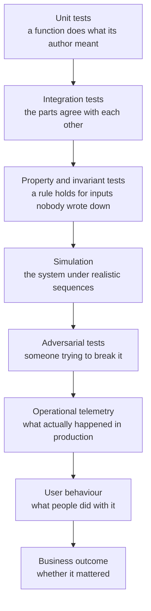

# 06 · Evaluation engineering

*Series: disciplines. Why "tests passed" is not "correct," the hierarchy of evidence you build instead, and how hard you are expected to try to prove yourself wrong. Read before You can prove it. ~13 minutes.*

## The sentence that gets people fired

"The tests passed." It is true, it is easy to say, and it is the sentence most often spoken in the hour before a production incident. Tests are a claim about the cases someone thought of. Correctness is a claim about all of them. Evaluation engineering is the discipline of closing that gap on purpose, and the skill it builds is the one the review sheet scores as Verification: not whether you checked, but whether your checks would have caught a wrong answer.

The rule that governs this discipline is short. **A check that cannot fail is not a check.** If you cannot say what result would have made you stop and revert, you have not verified anything; you have watched.

## The hierarchy

Evidence about a change comes in layers, and each layer catches what the one before it cannot.

Take a marketplace added to the world:

| Layer | The check | What it would catch |
|---|---|---|
| Unit | Buying decreases the buyer's gold by the price | Arithmetic and sign errors |
| Integration | A completed purchase persists across a server restart | A write that never reached storage |
| Invariant | Total item count across all inventories never increases except by minting | Duplication, the bug you cannot see in any single transaction |
| Simulation | Two hundred bots trading for ten minutes | Ordering and drift that only appear under sequence |
| Adversarial | Disconnect the buyer between confirm and commit; send a forged client message | Half-applied state; trust boundary violations |
| Load | A thousand simultaneous listings | The query that was fine at ten |
| Telemetry | Purchases per hour, failure rate, latency percentiles, after release | The thing that broke and nobody noticed |
| User behaviour | Do players actually trade? With whom? How often? | A working feature nobody wants |
| Business | Did trading change retention, or create exploitation that drove people away? | Success that was actually harm |

Nobody builds all nine layers for every change. The skill is knowing which layer a given change needs and building that one, and being able to say why the others were not worth their cost this time.

## Falsification strength

Founding tracks a metric it calls falsification strength, and it is the answer to a single question: **how hard did you try to prove your own work wrong?** Points come from what you found, not from what you ran.

- A counterexample to your own acceptance criteria
- An invariant violation under a sequence you constructed
- A failure under load
- A behaviour an adversary could exploit
- State left inconsistent after an interruption
- A user who could not do the thing you built
- A business effect you did not intend

An engineer who ran the suite and shipped scores low here even when the suite was green. An engineer who found and fixed a duplication bug in their own marketplace before anyone else saw it scores high, and it is the second engineer the review is looking for.

## The Gate 5 exercise

At some point you will be handed several systems and told: all of these pass their tests. Some are correct. Some contain a race condition, a security hole, a quiet requirement violation, a performance cliff, a state corruption, an accessibility failure, or a metric that lies. Finding the defects is the small part. The deliverable is the answer to a harder question: **what evidence would justify trusting this system?** Write that as a list of checks, then run them. A defect you found by luck teaches you less than a check that would have found it every time.

## Evaluating machine output specifically

An agent's output arrives with the confidence of a senior engineer and the track record of a stranger. Treat it as evidence to be evaluated, never as a result to be accepted. Concretely: before reading the diff, write down what you would expect to see and what would worry you. Then read. Where the diff surprised you, that is either your model wrong or the agent wrong, and you owe both a test. The program will sometimes hand you agent output that is subtly wrong on purpose, with green tests. You are being trained to notice, and the noticing is graded.

## The eval set: a test suite for a prompt

Everything above applies to code, and a prompt is not code. Change a word in a system prompt and nothing compiles differently, no test goes red, and the only way to know whether the change helped is to run the prompt against cases you already know the answer to and count. That is an eval set, and it is the smallest unit of evaluation engineering that the postings for this work ask for by name. It does not need a platform. It needs five to ten inputs with the outcome you expect from each, written down before you touch the prompt, so that the prompt cannot be edited to fit the cases after the fact.

The review phase in your delegation script is the first place you need one. You gave a model a rubric and asked it to say whether the build matched the plan, and at the moment you have no idea how often it is right, which means the reviewer is theatre until you check it. Take five diffs you know are correct and five you know are not, some with a subtle break, some with a loud one, and run the reviewer over all ten. Then change one thing about the rubric and run it again. The table that comes out, case by case, before and after, is the evidence. The part that turns it from a score into engineering is the error analysis underneath: for each case the reviewer got wrong, one line on why, because a reviewer that misses every off-by-one is a different problem from one that misses every missing test, and the fix for each is different.

Two habits carry over from the rest of this reading. Judge the outputs before you know which prompt produced them, or you will grade the one you prefer. And keep the cases that lost. An eval set with a perfect score is a set that is too easy, not a prompt that is finished.

## Observability is evaluation that runs forever

Tests run once. Telemetry runs while people are using the thing, which is where the layers above simulation live. A change that ships without a way to see whether it is working has not finished being evaluated; it has stopped being evaluated. For the founding weeks this can be as small as a counter and a log line. The habit is what matters: before you claim success, ask what number you would look at tomorrow to know you were wrong.

## Do this now (25 minutes)

Take the task you executed in Agentic workflow engineering, or any change you shipped this month.

1. Write, before looking at any test output, one sentence per layer: what check at that layer would apply, or why it does not.
2. Pick the highest layer that is cheap enough to build now. Build it.
3. Try to make it fail. Construct an input, a sequence, or an interruption. Spend at least ten minutes on this.
4. Write down what you found, including "nothing, and here is what I tried."
5. If the task used a prompt you wrote, a reviewer rubric or a planner instruction, write five cases with expected outcomes now, before changing the prompt. Run them, change one thing, run them again, and keep the table.

## Done when

You can name the result that would have made you revert, and you looked for it. For any prompt you are relying on, you can say how often it is right, on what, and you found out by counting.

## What's next

07 · Reliability and systems reasoning: the fundamentals you learn at the moment a failure makes them necessary.
