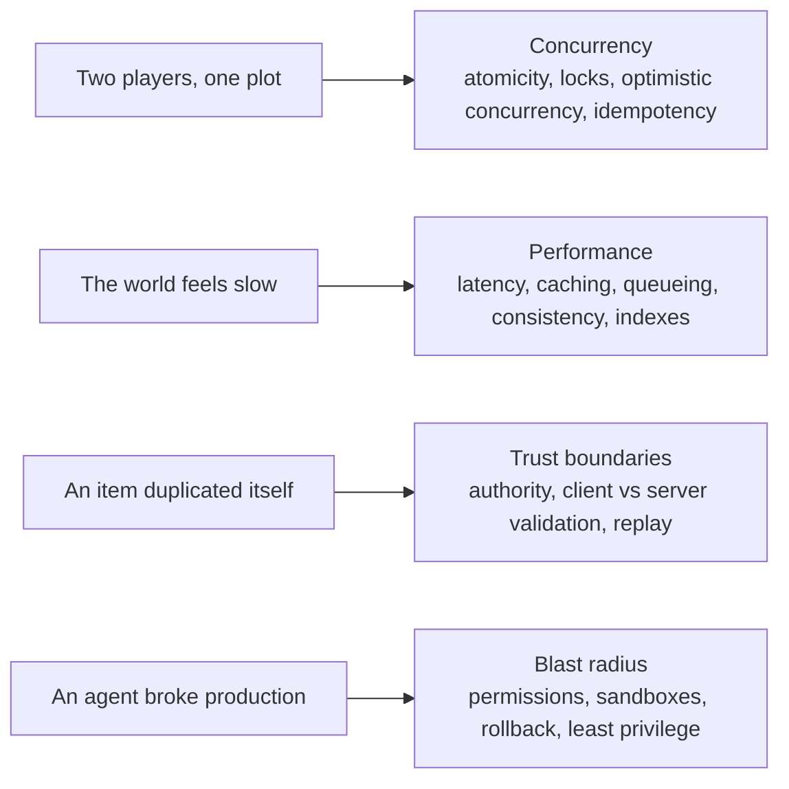

# 07 · Reliability and systems reasoning

*Series: disciplines. Concurrency, latency, trust boundaries and blast radius, taught when a failure makes each one necessary and not before. Read when something in the world breaks in a way you cannot explain. ~12 minutes.*

## Fundamentals, in the order reality asks for them

This program does not spend a fortnight on linked lists. It also does not pretend computer science stopped mattering because a model can write the linked list for you. What it does is change the order: you meet each fundamental at the moment a live system punishes you for not having it, and you remember it because the punishment was real. That is contextual knowledge instead of trivia knowledge, and it is the only kind that survives an interview where the interviewer changes one fact and watches whether your answer moves.

The four failures below are the ones the world produces most reliably. Each one opens a door to a cluster of concepts. Read the cluster when the failure arrives; skim it now so you recognise the door.

## Failure one: two players, one plot

Two players click the same empty plot in the same tick and both are told they own it. This is a race, and the cluster it opens is concurrency.

- **Atomicity**: an operation either fully happens or does not happen at all. "Check the plot is free, then assign it" is two operations, and the gap between them is where the second player lives.
- **Locks**: make the second player wait until the first is finished. Correct, and a bottleneck when a thousand players are clicking.
- **Optimistic concurrency**: let both proceed, and make the write fail if the row changed since it was read. Cheaper when conflicts are rare.
- **Idempotency**: an operation you can safely run twice. Claiming a plot you already own should do nothing, not throw, not double-charge. Every message that might be retried needs this property.

When you meet this failure, the question to answer in writing is: which of these does the current code use, and where is the gap?

## Failure two: the world feels slow

Players say movement is laggy. You have a symptom and, from Problem framing, a duty to produce hypotheses. The cluster is performance.

- **Latency** is the time one thing takes; **throughput** is how many things happen per second. Fixing one can worsen the other.
- **Caching** trades freshness for speed. The question is always what happens when the cache is wrong.
- **Queueing**: when arrivals exceed service, delay grows without bound. A server at ninety percent utilisation is one burst from collapse, whatever the dashboard calls it.
- **Consistency**: how long until every observer agrees on the world state, and what they see in the meantime.
- **Indexes**: the query that scanned forty rows in development scans four million in production. Look at the query plan before you blame the network.

The discipline is measuring before believing. A trace that shows where the milliseconds went is worth more than any hypothesis, including the correct one.

## Failure three: an item duplicated itself

Someone has two of something that exists once. The cluster is trust boundaries, and it begins with a single question: **who is the authority?**

- **Authority boundary**: for each piece of state, exactly one component decides its truth. If the client tells the server "I picked up the sword" and the server believes it, the client is the authority, and the client is in the hands of the user.
- **Client versus server validation**: validate on the client for responsiveness, validate on the server for truth. Skipping the second because the first exists is the classic duplication bug.
- **Replay**: a valid message captured and sent twice. Idempotency from failure one is the defence; an idempotency key on every state-changing message is the mechanism.
- **Trust boundary**: any place data crosses from something you control to something you do not. Draw it on your system model. Every arrow that crosses it needs validation on the trusted side.

## Failure four: an agent broke production

An assistant, given a task, did something outside the task, and the world is down. The cluster is blast radius, and it is the one this generation of engineers will meet most.

- **Least privilege**: the agent had the permissions to do it. Should it have? Grant the minimum a task needs, per task, and revoke it after.
- **Sandboxes**: run machine work somewhere its mistakes cannot reach users. Then promote deliberately.
- **Rollback**: the ability to return to the last known good state, rehearsed before you need it. A deployment without a rollback is a bet.
- **Blast radius**: before any change, machine or human, ask what else it can reach. You named it as three files on You can read a system and read it from the call graph in Who calls what. Apply it to permissions too.

## Writing the failure down

Every one of these failures should end as a short note in your log: what broke, which cluster it opened, what the system did before, what it does now, and what check now exists so it is caught next time. That note is reliability evidence, and it is the kind employers cannot get from a portfolio. Anyone can say they understand concurrency. "Resolved a duplicate-item race in a live multiplayer inventory; added an invariant test that would have caught it" is a different sentence.

## Do this now (20 minutes)

Pick the failure from the four that you have most nearly met, in the world or in your own work.

1. Write the failure as an observation, in one sentence.
2. From the cluster, name the concept the failure was missing.
3. Draw the trust or authority boundary the failure crossed, on your system model from System comprehension.
4. Write the invariant test or the check that would catch it next time. You do not have to implement it; you have to be able to.

## Done when

You can explain to a stranger why the failure happened using the concept's name correctly, and you can point at the check that makes it not happen again.

## What's next

08 · Product and value engineering: the change worked. Did it matter?
