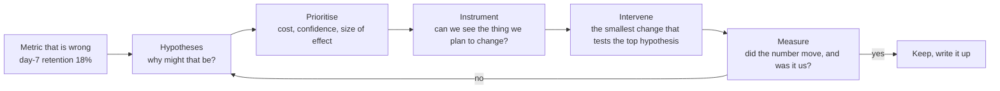

# 08 · Product and value engineering

*Series: disciplines. Connecting a technical change to something a user or a business actually experienced, and being able to show the connection. Read before A number moved. ~12 minutes.*

## The change worked. Did it matter?

Every other discipline in this series ends with a change that is correct. This one asks the question correctness cannot answer: was it worth building? A feature that passes every layer of evaluation and is used by nobody is a cost. An engineer who can only tell you that the code works has stopped one step short of the thing anyone is paying for, and the stop is where most careers plateau.

The review sheet scores this as Vision, and the sentence it is looking for is not "I built the trading system." It is "first-session player interaction was eleven percent; I changed the spawn layout; it is now thirty-four percent; here is why I think the change caused it." A person who can say that sentence, with evidence, has demonstrated something that no amount of implementation demonstrates.

## Start from a number, not a feature

The world hands you problems in two forms. The first is a ticket: implement feature 342. The second is an observation: new players are not coming back after their first session. The second form is the one this discipline trains, because it forces the chain from Problem framing to run at product scale.

For the retention example the hypotheses write themselves once you refuse to code first: onboarding is confusing; movement is unpleasant; players cannot find each other; there is no visible goal; loading is slow; spawn areas are empty; there is nothing social to do. Seven hypotheses. Each one has a different cost to test and a different plausible effect, and prioritising them is the work.

## Prioritisation is arithmetic

For each hypothesis, estimate three things, roughly:

| Question | Why it matters |
|---|---|
| How confident are we this is a real cause? | From the evidence gathered, not from taste |
| If it is, how big is the effect on the metric? | Fixing a cause that moves retention one point is not worth the week |
| What does the smallest test cost? | In hours and in risk to the live system |

Rank by expected effect divided by cost. Do the top one. Write down why the others waited, because "we did not get to it" and "we decided against it" are different sentences with different consequences when someone asks in three months.

## Instrument before you intervene

You cannot claim a change caused an improvement if you did not record the baseline. Before the intervention ships, the number it is meant to move must be visible, and it must have been visible for long enough that you know what normal looks like. For the founding weeks this can be a single event counter and a weekly total. The habit is non-negotiable: no baseline, no claim.

## Did we cause it?

A number moved after your change. Three things could be true: your change moved it, something else moved it, or it moved on its own and would have anyway. Distinguishing them is causal reasoning, and at the scale of a small live world you have a few honest tools:

- **Before and after with a long enough window** that day-of-week and one-off events wash out. Weak, but often all you have.
- **A holdout**: some players get the change and some do not, chosen randomly. Strong, when the numbers are large enough to mean anything.
- **A mechanism**: you can show the path from change to outcome, step by step, with an intermediate number that also moved. Players spawned nearer to each other, more first-session chat messages were sent, more players returned. Each link measured.

Say which you used, and say how sure you are. "Retention rose nine points; we changed spawn layout the same week; no holdout; the intermediate measure of first-session interaction also rose; moderate confidence that we caused it" is a sentence a serious engineer says. "We increased retention by fifty percent" is a sentence a serious engineer does not trust.

## Opportunity cost and the answer "no"

The week you spend on the top hypothesis is a week you did not spend on the second. That is opportunity cost, and it means the honest evaluation of any intervention includes what it displaced. Sometimes the arithmetic says the best intervention is to not build the thing that was asked for, and to say so with the numbers attached. Founding treats "we should not build this, here is why" as a passing outcome for A number moved, when it is argued with evidence. It is one of the more valuable things you can learn to say.

## Do this now (20 minutes)

Take a product you use daily.

1. Name one metric its makers almost certainly watch. Guess its value.
2. Write five hypotheses for why it is not higher.
3. For each, one line: confidence, plausible effect, cost of the smallest test.
4. Rank them. Write one sentence on what you would instrument before touching anything.
5. Write the sentence you would want to say in a month, in the form: metric was X, we did Y, metric is Z, here is why we believe Y caused it.

## Done when

You can defend your ranking to someone who prefers a different hypothesis, using the arithmetic and not your preference.

## What's next

09 · Technical communication and defense: the model in your head is worth nothing until it survives contact with another engineer.
