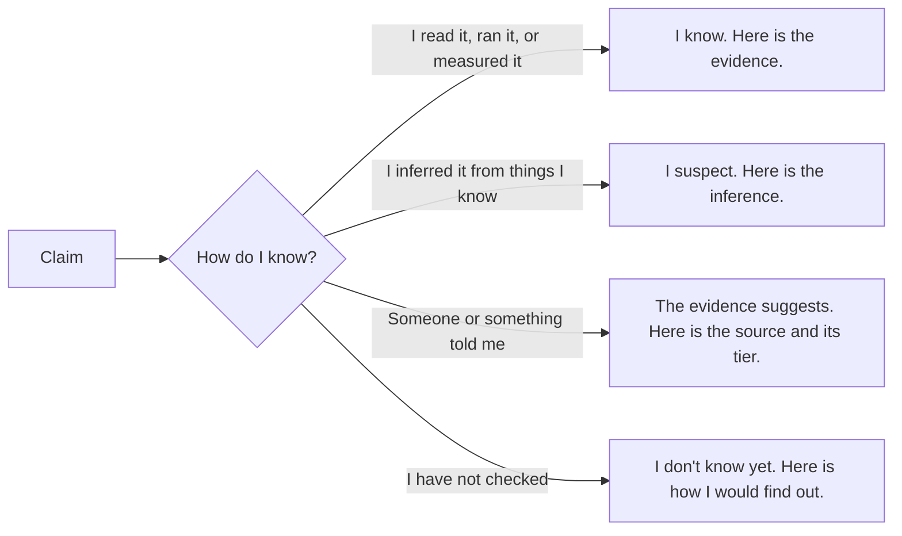

# 09 · Technical communication and defense

*Series: disciplines. Compression, precision, audience, uncertainty, and staying upright when another engineer attacks your reasoning. Read before You defend it live. ~13 minutes.*

## Not a soft skill

Communication gets filed under soft skills because it is hard to grade, and things that are hard to grade get taught badly. This program grades it, as one of the four skills on every review, and it grades it as an engineering discipline with a definition: **information survives the transfer from your head to someone else's, without loss, and your reasoning survives being attacked.** Both halves are measurable. The founding review measures the first as clarification debt and communication fidelity, and the second in the live defense that ends the program.

Five capabilities make it up.

## Compression

Explain the system to someone who has five minutes. Then two. Then one sentence. Each compression forces you to decide what is load-bearing, and if you cannot compress, you do not yet know which parts matter. The reverse is also true: someone who can only give the one-sentence version and cannot expand it back to the five-minute version has memorised a slogan. You are being asked to hold both and move between them on demand.

The work is on the site is a compression exercise: the thing you built, what it proves, and the link, in a length a stranger will finish.

## Precision

Can another person execute what you wrote without guessing? This is Specification engineering seen from the reader's side, and the test is the same: hand the document over, disappear, count the questions. Precision is not length. The trading sentence from that reading is precise because every clause closes a door, not because it is long. A precise sentence often replaces three vague paragraphs.

## Audience modelling

The same change is a different explanation to each of these people, and knowing what each one needs is the skill.

| Audience | What they need from you | What they do not need |
|---|---|---|
| Another engineer | The mechanism, the invariants, the blast radius, how you checked | Motivation they already share |
| Security | The trust boundaries this crosses and how they are validated | Feature details |
| Product owner | What changed for the user, what it cost, what it displaced | Implementation |
| Executive | The outcome, the risk, the decision needed from them | Everything else |
| A user | What they can now do and what they should expect | Why it was hard |

Write the engineer's version first. Derive the others from it by deletion, not by invention; if the executive's version contains a claim the engineer's version does not support, you have started marketing.

## Uncertainty

Three sentences that must never be confused:

> I know this.

> I suspect this.

> The available evidence suggests this.

Each carries a different confidence and each obliges the listener to do something different. An engineer who says "I know" when they mean "I suspect" is spending trust they will need later, and an engineer who says "I suspect" about something they verified is wasting everyone's time re-checking it. The program tracks this as comprehension calibration: when you say ninety percent, are you right about nine times in ten? Calibration is rare, and it is one of the strongest signals a reviewer can give an employer about you.

Every claim in your write-ups should be traceable to one of the four leaves, and the fourth leaf is a respectable place to be.

## Adversarial defense

An engineer who did not help you reads your change, forms their own model, and then attacks yours. They will change one fact and ask what follows. They will ask why not the alternative. They will point at the invariant you did not test. This is the founding You defend it live step and it is the closest thing the program has to a final exam, because it is the one thing an assistant cannot do for you in the room.

What passing looks like is not having every answer. It is:

- **Your model updates when a fact changes.** "If the gateway can retry, then the idempotency key matters here, and I did not add one; that is a gap." A memorised explanation cannot do this; it just repeats itself louder.
- **You distinguish what you know from what you inferred**, out loud, without being asked.
- **You concede correctly.** When the attacker is right, say so in one sentence and move on. When they are wrong, say why with evidence, not volume.
- **You do not defend the code; you defend the decision.** The question is whether the choice was reasonable given what was known, and whether you knew what you did not know.

The attacker is not your enemy. They are the most useful reader you will have, because they are the only one motivated to find the hole before production does. Learning to want the attack is most of the discipline.

## Decision records

The lightest form of all of this is the decision record: a short note, written when a decision is made, that says what was decided, what the alternatives were, why this one, and what would make you revisit it. It takes ten minutes. In three months it is the only reason anyone, including you, can explain why the system is shaped the way it is. Write one for every non-obvious choice in your owned system, and link them from your log.

## Do this now (25 minutes)

Take the change you have been carrying through this series.

1. Write the engineer's explanation. Mechanism, invariants, blast radius, checks. No more than 200 words.
2. Compress it to two sentences. Then one.
3. Derive the product owner's version by deletion.
4. Mark every claim in the engineer's version with K, S, E or U from the diagram.
5. Ask an assistant to attack the engineer's version: "Change one fact about this system and ask me what follows. Then ask why I did not choose the obvious alternative." Answer in writing. Notice where your model moved and where it did not.

## Done when

A reader with five minutes and a reader with one minute both come away with the same load-bearing facts, and you can name which of your claims you would bet on.

## What's next

10 · Evidence, gates and the ledger: how the program measures you, and why every number has to be clickable.
