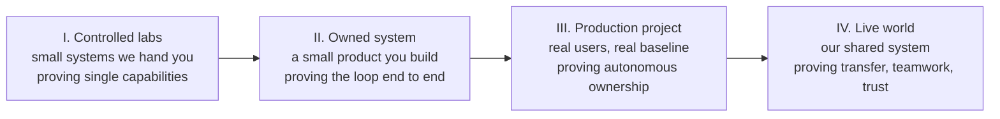

# 10 · Evidence, gates and the evidence record

*Series: disciplines. How this program measures you: the six gates, the seven levels of evidence, the score vector, and the four metrics your log tracks from week one. Read in week one, and again before You defend it live. ~14 minutes.*

## Every step is a falsifiable claim

Every step carries a six-field contract, visible on the step page under "What this step proves," written in the same shape as the checks you write for code.

| Field | The question |
|---|---|
| Claim | What capability do we say you acquired? |
| Challenge | What behaviour would demonstrate it? |
| Evidence | What artifact or observation records that behaviour? |
| Falsification | What would convince us you do not have it? |
| Threshold | What counts as passing? |
| Transfer | Where must you show it again later, in a place you did not choose? |

Every step on the Map must fill these six fields. The same principle applies to tests and lessons: each needs a defined condition that can show failure.

## Progressively less control

The program uses environments that become less controlled over time. Capability becomes visible when you work under conditions you did not choose.

Along that line the instructions thin out on purpose. Early: here is the system, the problem, the desired outcome and the evaluation. Later: here is the system and the problem. Later: here is the system. Finally: here is reality, find something worth improving. The eight-week intensive runs levels I and IV in a compressed form, with the owned-system depth nodes available for anyone with time. Levels II and III as full projects are the shape of the longer program.

## The six gates

Before the live world trusts you with a change that matters, six small demonstrations, each mapped to a step on the Map.

| Gate | Tests | Step | You pass when |
|---|---|---|---|
| 1 Comprehension | You can model unfamiliar code | You can read a system | Your predictions about the system's behaviour under change are mostly right, and you can say which ones you were unsure of |
| 2 Problem discovery | You distinguish the underlying problem from its symptom | You found the real problem | Your framing has more than one hypothesis and names the evidence that would settle it |
| 3 Specification | Someone else can execute your words | Someone else can build it | Clarifications requested against your spec stay low |
| 4 Delegation | You direct machines and record it | You ran the agents | Your intervention log reconstructs what the human did |
| 5 Verification | Your checks could have failed | You can prove it | You name the result that would have made you revert, and you looked for it |
| 6 Communication and outcome | Your reasoning survives a stranger | You defend it live and A number moved | Your model updates under a changed fact; your outcome claim has a baseline |

The gates form the core sequence. Everything else on the Map is depth you add when the gates are behind you.

## Levels of evidence

Evidence carries different weights. When you make a claim about yourself, identify its level. The program asks you to move every important claim toward the stronger evidence near the bottom of this table.

| Level | Kind | Example | Weight |
|---|---|---|---|
| 0 | Self-reported | "I am strong at agent orchestration" | None |
| 1 | Artifact | A repository exists | Weak |
| 2 | Instrumented behaviour | We can see how it was produced: the intervention log, the commits, the checks | Better |
| 3 | Controlled challenge | The capability reproduced under conditions you did not choose | Strong |
| 4 | Independent human evaluation | An engineer who owed you nothing reviewed it | Stronger |
| 5 | Production consequence | Real users or real system behaviour changed | Very strong |
| 6 | Repeated transfer | The same capability across unrelated environments | Strongest |

A portfolio is level 1. An eight-week review is level 4. A changed retention number in the live world is level 5. The Transfer field on every step exists to get you to level 6 at least once per capability, which is why the same skill keeps showing up in places you did not pick.

## The score vector

At the end you receive a score vector. Every entry links to the evidence that produced it.

| Score | Meaning | Where the evidence comes from |
|---|---|---|
| System comprehension | Accuracy of your models | Gate 1 predictions, defense |
| Specification precision | Executable without clarification | Clarification counts on your specs |
| Verification strength | Would your checks have caught it | Falsification findings, defects caught |
| Autonomy | Human intervention required | Intervention log |
| Agent efficiency | Useful output per unit of human effort | Task records with cost and time |
| Judgment calibration | Stated confidence against actual correctness | Claim, confidence, outcome triples |
| Communication fidelity | Information preserved across handoffs | Handoff exercises, review notes |
| Value creation | Measured product or system improvement | Baseline, intervention, result |
| Collaboration | Effectiveness in shared work | Reviews given, defects found in others' work |
| Learning velocity | How fast wrong models get corrected | Log entries over time |

An employer who clicks Verification should see the count of evaluated tasks, the checks you wrote, the defects you found, the defects you missed, and the review that graded them. Without those links, the score provides little evidence beyond a conventional grade.

## The four metrics your log tracks from week one

The student log template has four numbers in it that are unusual. They are there because they are the most honest signals the program has found.

- **Clarification debt.** Clarifications requested divided by specifications handed over. How often does someone else's work stop because your representation was not enough? Watch it fall.
- **Comprehension calibration.** For each claim about a system, record your confidence. When the truth arrives, score it. Are your ninety-percents right nine times in ten?
- **Intervention rate.** Useful completed outcome divided by human interventions on delegated work. It should fall over the program while quality holds. If quality falls with it, you learned to look away.
- **Falsification strength.** How hard did you try to prove your own work wrong? The evidence includes counterexamples, invariant violations, load failures, adversarial findings, and unintended effects you found before someone else did.

## Rotating roles, later

In the longer program, teams of five take missions in the live world, and for every mission the responsibility roles rotate: outcome owner, system investigator, specification owner, execution orchestrator, evaluation owner. Everyone passes every role. The eight-week intensive is solo, but the roles are already visible in the gates: each gate is one of those hats worn for one week. When you reach the team version you will have worn each of them once.

## Do this now (15 minutes)

Open your student log.

1. For the step you are on, read its "What this step proves" block. Write, in your own words, what would convince a reviewer you do not have the capability.
2. Make your first claim, confidence, outcome entry: one thing you believe about the world's code, a percentage, and how you will find out.
3. Write the current value of your four metrics, even if three of them are "not yet measured." The zeros are the baseline.

**Done when** you can use the levels table and concrete examples to explain why these scores provide stronger evidence than a certificate.

## What's next

11 · The portfolio thread: the personal site, the design system, the research posts, and why your public record is an engineering artifact too.
