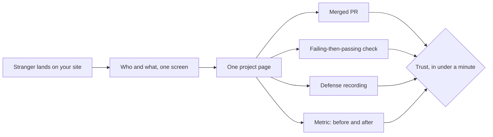

# 11 · The portfolio thread

*Series: disciplines. Your public record is an engineering artifact: the site, the design system behind it, the research you publish, and the users you can point at. Read before LinkedIn that reads as you; return to it at Your site is live. ~13 minutes.*

## What a portfolio is for now

A portfolio used to be a gallery: here are things I made, please be impressed. That stopped working the week a model could produce the gallery in an afternoon. Nobody hiring in 2026 is short of candidates with a site, a repo and a project list. What they are short of is a way to tell which candidate can be trusted inside a system they do not own, and your public record is the only place they can look before they meet you.

So the portfolio's job changed. It is no longer a display of output. It is a **record of evidence**, arranged so a stranger with four minutes can get from "who is this" to "this person did a real thing and I can check it" without your help. Everything in this reading follows from that sentence.

## The sentence, and the clauses under it

Do not write "built a multiplayer game." Write "contributed to a continuously operating multiplayer system," and then let each clause underneath it point at a receipt.

| Clause | The receipt behind it |
|---|---|
| Mapped a subsystem I had never seen, and the map was checked | Your trace note from You can read a system, with the reviewer's note |
| Wrote specifications other people executed without needing me | The spec from Someone else can build it, with its clarification count |
| Completed production tasks with agents, every intervention recorded | Your intervention log from You ran the agents |
| Wrote checks that caught a real regression | The failing-then-passing check from You can prove it |
| Resolved a concurrency defect in a live inventory | The ticket, the PR, the invariant test |
| Moved a number | Baseline, change, result, from A number moved |
| Defended a change to an engineer who did not help me | The defense recording |
| Reviewed a peer's change and found something | Your review comments |

A stranger who clicks any row and lands on a real PR, a real check, or a real recording believes the next row too. A stranger who clicks and lands on a screenshot of a tutorial stops reading. One page that does this beats five that do not, which is why The work is on the site asks for one project page, with receipts, and grades it on whether proof is reachable in under a minute.

## The design system underneath

Everything you put in public should look like it came from the same person: the site, the project page, the diagrams in your posts, the screenshots in your PRs, the slide behind you in a defense recording. This is not vanity. Consistency is a signal that the person on the other end has a method, and a method is what employers are actually buying. Inconsistency signals the opposite, and it does so before anyone has read a word.

The depth step Your look, on every screen asks you to write this down once and apply it everywhere:

- **Tokens.** Two or three colours, one accent, one type family for prose and one for code, a spacing scale. Written as variables, not remembered.
- **Type.** A heading scale and a body size that read well at phone width, because that is where a recruiter will first open your link.
- **One diagram style.** A Mermaid theme file with your tokens in it, so every graph you publish in a post or a PR looks like yours. You have been reading diagrams in this house's theme through this whole series; that is what it looks like when someone does this.
- **One screenshot convention.** Same window size, same padding, same annotation colour. Boring, and it makes a PR description read like a professional wrote it.

The method is the same one this program used to build its own site, and the artifact is a single document you can hand to a model with "apply this" and get consistent output back. That handoff is itself a specification, and it is graded like one.

## Research in public

The skills this industry will hire for in three years do not have names yet. The people who get found for them are the ones who were visibly poking at them before the names arrived. That is what the depth step Research you ran yourself is for: one experiment you ran because you wanted the answer, published with the same discipline you would apply to a production change.

The shape is fixed, and it is the shape of every honest experiment:

| Section | What goes in it |
|---|---|
| Claim | The thing you suspected, as a sentence that could be wrong |
| Method | What you did, precisely enough that someone could repeat it |
| Result | What happened, with the numbers, including the ones that disappointed you |
| What it does not show | The limits of the method, said before anyone else says them |
| Next | What you would try next and why |

Small is fine. "Does giving an agent the call graph reduce its interventions on a mechanical refactor? I ran twelve tasks each way; here is the count" is a research post, and it is more interesting than most of what is published on the subject because it has a method and a number. The post also feeds the system you build in A system that feeds posts: research is the highest-grade raw material that system will ever have.

## Posting as an engineering habit

The posting steps on the map, One post from the system and Two posts in seven days, are not there to make you a content creator. They exist because a public record that stops updating looks abandoned, and because writing about a change you shipped is the cheapest defense rehearsal available: if you cannot explain it to strangers in two hundred words, you will not explain it to an engineer in a live room either. Treat every post as the compression exercise from Technical communication and defense, with a link.

## When the thing you built has users

If your owned system does something useful for other people, the depth step Real people used it asks you to find five of them, record a baseline, ship a change, and measure. Revenue is not required and is deliberately not rewarded here, because requiring it would push everyone toward the easiest thing to charge for. Observed value is required. If value turns into customers, the receipt for that is the same baseline-and-result you would have produced anyway, and it belongs on the project page next to the PRs. Gaining attention and gaining customers are downstream of the same artifact: evidence a stranger can check.

## Do this now (20 minutes)

1. Write the sentence. Not "built X"; "contributed to Y." Then list the clauses you can already back with a link, and the ones you cannot yet.
2. For each clause you cannot back, name the step on the map that will produce the receipt.
3. Open your site, or the folder where it will live. Write down the two colours, the type family and the accent you will use for everything. Put them in a file.
4. Write one research claim you actually want the answer to, as a sentence that could be wrong.

## Done when

A stranger can reach a real receipt from your site in under a minute, and everything they see on the way looks like it came from one person with a method.

## What's next

12 · Work states after Scrum: the board you pull from and the model underneath it.
