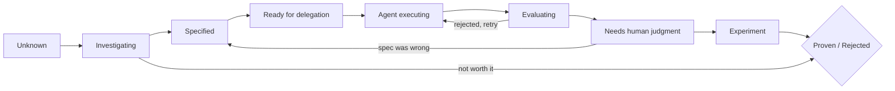

# 12 · Work states after Scrum

*Series: disciplines. Why the board has three columns and the model in your head should have nine, what Scrum was for, and the metric that replaces velocity. Read after How a working week runs. ~11 minutes.*

## Processes manage bottlenecks

Waterfall solved a problem: large projects with many hands needed a plan before anyone poured concrete. Agile solved the problem waterfall created: plans made once were wrong by the time they shipped, so shorten the loop and check with reality often. Scrum gave agile teams a repeatable mechanism for doing that: a backlog, a sprint, a standup, a review, a retrospective, repeat. Each of those was a good answer to the bottleneck of its time, and the bottleneck each one addressed was the same: **implementation was expensive, and human implementers were the constraint.**

Here is the rule that outlives all three: processes exist to manage bottlenecks, and when the bottleneck moves, the process must move with it. If you keep running a process designed for a constraint that no longer binds, you are performing a ritual, and rituals are how teams stay busy while producing nothing.

## Where the bottleneck went

When a model can write the implementation, the sprint's central question, how many story points fit, stops being the interesting one. The interesting questions become:

- Which work is actually understood well enough to specify?
- Which specifications deserve execution at all?
- Which agent output is sitting there waiting for a human to judge it?
- Which experiment needs evidence before anyone decides?
- Which dependency is blocking autonomous execution?
- Where are the agents repeatedly failing, and is that the spec's fault?

The labels TO DO, IN PROGRESS, REVIEW, and DONE leave those questions unanswered. A ticket can sit in IN PROGRESS for a week while the team is still defining it, an agent has produced three incorrect versions, and a human review remains pending. The three-column board hides every one of those states inside one word.

## The model you carry

The board you pull from in this program keeps three columns, because a small team shipping weekly does not need a nine-column board and because the mental model matters more than the number of columns. The model is this:

| State | What is true | The discipline that moves it forward |
|---|---|---|
| Unknown | Someone wants something; nobody has framed it | Problem framing |
| Investigating | Hypotheses exist; evidence is being gathered | System comprehension |
| Specified | A contract exists that someone else could execute | Specification engineering |
| Ready for delegation | Decomposed; context and boundaries written | Agentic workflow engineering |
| Agent executing | Machines are working; the human is watching checkpoints | Agentic workflow engineering |
| Evaluating | Output exists; checks are being run against it | Evaluation engineering |
| Needs human judgment | The checks raised something only a person can decide | Reliability, value, communication |
| Experiment | It shipped to some reality; a number is being watched | Product and value engineering |
| Proven / Rejected | The evidence is in, and it says one or the other | The evidence record |

Every ticket you take carries a contract, and the contract names which of these states the ticket is really in. When you say "in progress" in a Monday call, be able to say which of the nine you mean. A useful status is specific: "In progress: agent executing, two interventions so far, evaluating by Thursday." The words "in progress" alone leave the state and next action unclear.

## Why the arrows point backward too

Needs human judgment often sends work back to Specified, because the human judgment exposed a gap in the specification. Evaluating sends work back to Agent executing when the output was rejected and the spec was fine. Investigating sometimes goes straight to Rejected, because the honest finding was that the problem was not worth solving. A board that has no backward arrows is a board that is lying about how work happens, and a team that treats backward movement as failure will hide it, which is worse.

## The metric that replaces velocity

Story points measured how much implementation a team could produce, which was the right thing to measure when implementation was the constraint. The measure this program teaches instead is:

> **Proven outcomes per unit of human attention.**

Proven means the work reached the last state with evidence. Human attention is the scarce input: the hours of framing, specifying, judging, and evaluating that still require a person. A team that ships forty changes and proves that three mattered has a lower rate than a team that ships six and proves that five mattered. For this reason, every other reading in the series ends with evidence of an outcome.

## Learn the states, then choose a tool

The ticket board you use here is a real one, and the vocabulary you learn on it is the vocabulary working teams use. Atlassian is rebuilding Jira around this transition: agent-ready specifications, work handed to coding agents, agent sessions monitored, machine cost measured against output. That is useful confirmation, and it changes nothing about what you should learn. Learn the states. Any board can be made to show them; no board will think for you about which one a ticket is in.

## Roles, later

When the cohort is a team, each mission names five responsibilities and rotates them: outcome owner, system investigator, specification owner, orchestrator, evaluation owner. Look at the state table again and you will see that each role owns a stretch of it. During the eight-week intensive, one role of the week is named on the Monday call and recorded in your log. You are practising the hats one at a time so that, when you wear them on a team, none of them is new.

## Do this now (15 minutes)

1. Open the ticket board. For every story you have touched, write which of the nine states accurately describes the work, regardless of its current board column.
2. For the one furthest along, write the evidence that would move it to Proven, and the evidence that would move it to Rejected.
3. Write one sentence on your own proven outcomes per unit of attention this week. It is allowed to be zero over many hours; the honesty is the exercise.

**Done when** you can give a status in a Monday call that names a state, the evidence gathered so far, and what would move it next, in under thirty seconds.

## What's next

13 · Evaluation modes and traps: when the assistant is allowed, when it is constrained, and why some of what you are handed is wrong on purpose.
