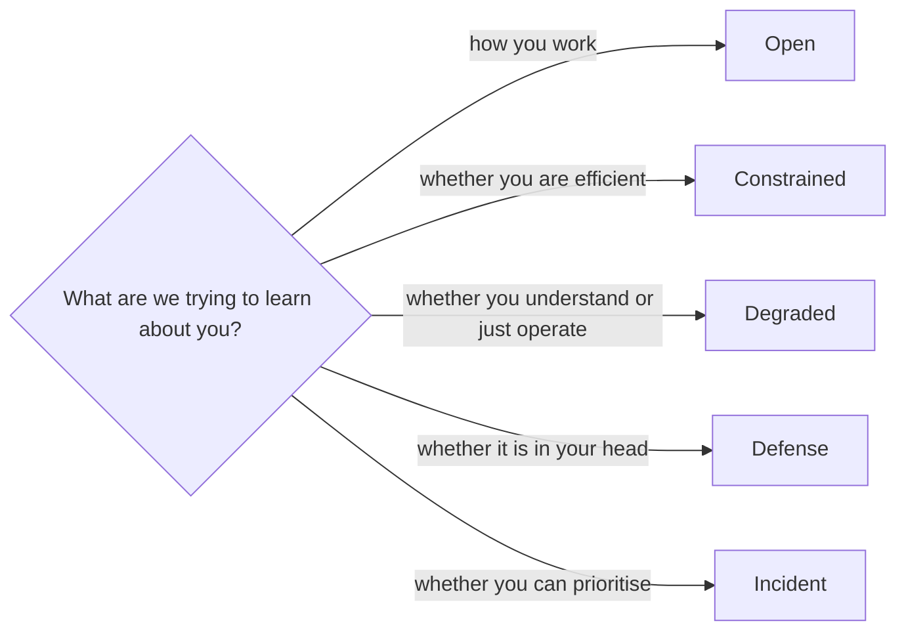
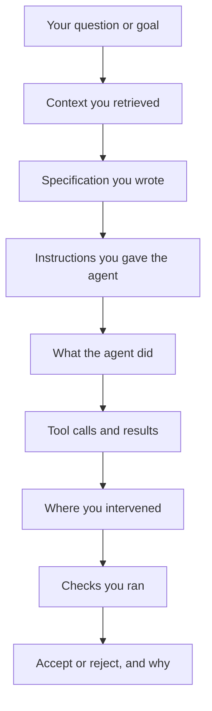

# 13 · Evaluation modes and traps

*Series: disciplines. When the assistant is open, constrained, removed or silenced, why your use of it has to be visible, and the honest warning that some of what you are handed is wrong on purpose. Read in week one. ~10 minutes.*

## Banning the assistant tests the wrong thing

A program that forbids AI to prove you can code is testing you for an environment that no longer exists. You will be employed in rooms where every model is available, and the question your employer cannot yet answer is not whether you can work without them but whether what happens when you work with them can be trusted. So this program does not ban the assistant. It varies the conditions, says which condition a step is in, and watches.

## The five modes

| Mode | Rule | What it tests | Where you meet it |
|---|---|---|---|
| Open | Every model, agent, search and tool you can reach | Employment. How you actually work | Every ticket, the owned system, the career steps |
| Constrained | A fixed budget: a dollar figure of inference, or one model only | Efficiency. Whether more machine was more progress | The measurement in Feed the model less, get more; optionally a second ticket |
| Degraded | Your favourite tool removed | Principles over interface. Whether you understood or memorised a UI | A Coach drill; one review question on Your first ticket |
| Defense | AI allowed before, silent during oral questioning | Transfer. Whether the knowledge reached your head | You defend it live; the counterfactuals on You can read a system |
| Incident | A production problem, a clock, AI allowed | Prioritisation under pressure | The overnight watch on Staging to live |

Each step's page says which mode it runs in. If it says nothing, it is Open. Defense mode is the one people find hardest, and it is hardest for the right reason: an assistant can write your specification and your check and your PR description, and none of that is cheating, and none of it will be in the room when an engineer changes one fact and asks what follows.

## One constraint holds in every mode

**Your use of AI has to be observable.** Not because using it is suspect; the opposite. Operating the machine is part of what is being evaluated, and a reviewer cannot evaluate what they cannot see. The agent log on your PR, the failure log, the intervention record from You ran the agents: these exist so someone can reconstruct the one thing employers are starting to ask and cannot yet answer, which is **what did the human contribute?**

You do not need every token forever. You need enough that a reader can trace:

A record with those boxes filled in is level 2 evidence on the ladder from Evidence, gates and the ledger. A green PR with no record is level 1, and it is level 1 no matter how good the code is.

## Some of what you are handed is wrong on purpose

You should know this going in, because knowing it is part of the training and because hiding it would be a kind of dishonesty this program does not practise.

At points across the eight weeks, never on your first ticket, and always followed by a debrief, you will meet situations built to test whether you treat machine output as evidence or as authority. The kinds of thing to expect:

- An assistant given context that is stale or misleading, so its confident explanation is wrong.
- A change where the obvious implementation is the wrong one.
- A test suite that is green while a requirement is broken.
- A task where the cheapest model is entirely sufficient and a frontier model adds nothing but cost.
- A problem where a complicated multi-agent arrangement loses to one well-contexted call.
- A ticket where the correct answer, argued with evidence, is "do not build this."

You will not be told which steps carry these. That is the point. The two lessons every trap teaches are the same two lessons, and once they are reflexes the traps stop being traps:

> **AI output is evidence, not authority.**

> **Complexity is not sophistication.**

A student who runs the checks before trusting the output, who asks what the cheapest sufficient tool is before reaching for the largest, and who is willing to say "this should not be built" with the numbers attached has stopped being catchable, and that is the state the program is trying to produce.

## What this means for how you work

Three habits, from week one:

1. **Write what you expect before you read what the machine produced.** A prediction made first cannot be contaminated by a fluent answer.
2. **Write the check before you trust the green.** A passing suite is a claim about the cases someone thought of; ask which cases nobody did.
3. **Record every intervention, including the ones that embarrass you.** The log where you stopped an agent seventeen times is more valuable than the one where you claim you stopped it twice, because the first one is believable.

## Do this now (10 minutes)

1. Open the step you are on. Find its mode. If it is Open, write one sentence on what you would do differently if it were Defense.
2. Look at your last PR or task. Could a stranger reconstruct, from what is attached to it, what you did and what the machine did? If not, write down the one artifact that would have made it possible.
3. Write the sentence "AI output is evidence, not authority" at the top of your log, and under it the last time you treated it as authority anyway.

## Done when

You can say, for every step on your map, which mode it is in and what a record of your machine use would need to contain for a reviewer to trust it.

## Series end

You have the eight disciplines, the ladder they are measured on, the thread that carries the evidence into public, the model of work that replaces the sprint, and the conditions under which you will be watched. Everything else is doing it. Go back to the step you are on.
