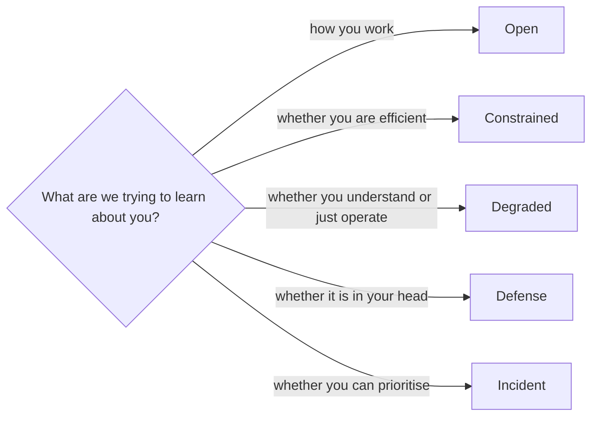
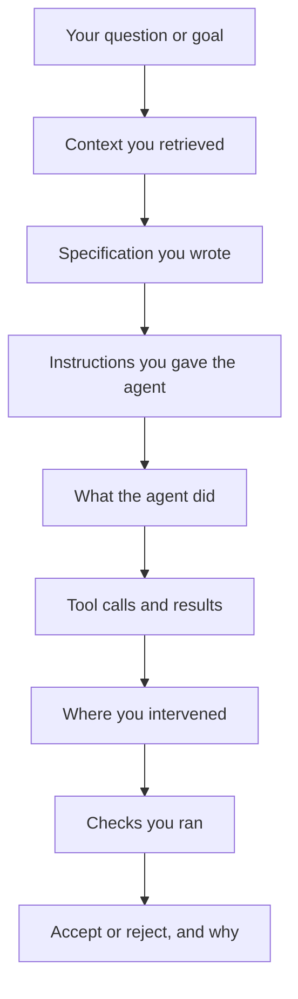

# 13 · Evaluation modes and traps

*Series: disciplines. When the assistant is open, constrained, removed or silenced, why your use of it has to be visible, and the honest warning that some of what you are handed is wrong on purpose. Read in week one. ~10 minutes.*

## Banning the assistant tests the wrong thing

Most engineering workplaces allow access to AI models. Employers therefore need to know whether they can trust the work you produce with those models. This program allows the assistant under several named conditions. Each step states its condition so reviewers can evaluate the relevant skill.

## The five modes

| Mode | Rule | What it tests | Where you meet it |
|---|---|---|---|
| Open | Every model, agent, search and tool you can reach | Employment. How you actually work | Every ticket, the owned system, the career steps |
| Constrained | A fixed budget: a dollar figure of inference, or one model only | Efficiency. Whether more machine was more progress | The measurement in Feed the model less, get more; optionally a second ticket |
| Degraded | Your favourite tool removed | Principles over interface. Whether you understood or memorised a UI | The timed Coach prompt What the PR does not test; one review question on Your first ticket |
| Defense | AI allowed before, silent during oral questioning | Transfer. Whether the knowledge reached your head | You defend it live; the counterfactuals on You can read a system |
| Incident | A production problem, a clock, AI allowed | Prioritisation under pressure | The overnight watch on Staging to live |

Each step's page says which mode it runs in. If it says nothing, it is Open. Defense mode is often the hardest. You may use an assistant beforehand to write a specification, check, or pull request description. During oral questioning, you must answer from your own understanding when an engineer changes one fact and asks what follows.

## One constraint holds in every mode

**Your use of AI has to be observable.** Operating the machine is part of what the program evaluates, so the reviewer needs a record of your actions. The agent log on your PR, the failure log, the intervention record from You ran the agents: these exist so someone can reconstruct the one thing employers are starting to ask and cannot yet answer, which is **what did the human contribute?**

Keep enough of the record for a reader to trace:

A record with those boxes filled in is level 2 evidence on the ladder from Evidence, gates and the evidence record. A green PR with no record is level 1, and it is level 1 no matter how good the code is.

## Some of what you are handed is wrong on purpose

The program discloses these exercises in advance so you know that some supplied output may contain deliberate defects.

At selected points across the year, after your first ticket and with a debrief afterward, you will meet situations built to test how you evaluate machine output. The kinds of thing to expect:

- An assistant given context that is stale or misleading, so its confident explanation is wrong.
- A change where the obvious implementation is the wrong one.
- A test suite that is green while a requirement is broken.
- A task where the cheapest model is entirely sufficient and a frontier model adds nothing but cost.
- A problem where a complicated multi-agent arrangement loses to one well-contexted call.
- A ticket where the correct answer, argued with evidence, is "do not build this."

The program does not identify the affected steps in advance. Apply these two rules to every step:

> **Treat AI output as evidence that requires verification.**

> **Additional complexity must justify its cost.**

The program expects you to run checks before trusting output, choose the least expensive tool that can do the work, and use evidence to recommend against building a request when appropriate.

## What this means for how you work

Practice these three habits from week one:

1. **Write what you expect before you read what the machine produced.** A prediction made first cannot be contaminated by a fluent answer.
2. **Write the check before you trust the green.** A passing suite is a claim about the cases someone thought of; ask which cases nobody did.
3. **Record every intervention, including the ones that embarrass you.** The log where you stopped an agent seventeen times is more valuable than the one where you claim you stopped it twice, because the first one is believable.

## Do this now (10 minutes)

1. Open the step you are on. Find its mode. If it is Open, write one sentence on what you would do differently if it were Defense.
2. Look at your last PR or task. Could a stranger reconstruct, from what is attached to it, what you did and what the machine did? If not, write down the one artifact that would have made it possible.
3. Write the sentence "Treat AI output as evidence that requires verification" at the top of your log, and under it the last time you treated it as authority anyway.

**Done when** you can say, for every step on the Map, which mode it is in and what a record of your machine use would need to contain for a reviewer to trust it.

## What's next

14 · Containment and accountability: the controls and records required when an agent runs without direct supervision.
