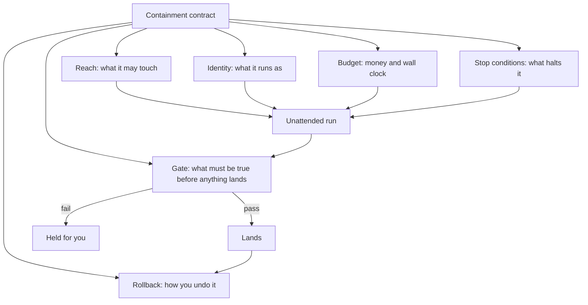

# 14 · Containment and accountability

*Series: disciplines. What holds when nobody is watching: reach, credentials, budget, stop conditions, the gate, the rollback, and the record you sign afterward. Read before You ran it unattended. ~14 minutes.*

## The question this discipline asks

Agentic workflow engineering asked where a human must stand. It gave you a boundary table and an intervention log, and both assume you are there, watching, ready to stop the thing. That assumption is now the exception rather than the rule. Frontier agents run for hours. They wait on external processes, resume, retry, and keep going after you have gone to bed. The operator who ran one overnight and woke up to three finished game scenes was not supervising anything. He was asleep.

So the question changes. Not "where do I stand," but **"what holds when nobody is standing there."** That is containment, and the reason it is a separate discipline is that the answer is not vigilance. Vigilance does not scale past one agent and does not survive sleep. The answer is a set of constraints you build before the run, which hold whether or not you are conscious, plus a record afterward that lets somebody reconstruct what happened. Every part of that is engineering, and almost nobody is being taught it.

## Why this is the paid work

Two numbers, held together.

Model capability roughly doubles on task length every three to four months. The share of enterprises that get an agent pilot into production sits around eleven percent. The failures are not model failures. When people who study the abandoned projects list the causes, they name legacy integration, data that was never ready, no evaluation harness, no tracing, and no agent identity governance. Twenty-three percent of enterprises have any strategy for the last one. Eighty-seven percent report delaying a deployment because they could not answer what data the thing could reach, who owned its actions, and whether anyone could audit it afterward.

The clearest single expression of this: the most capable model released to date shipped with its enterprise setting **off by default**, requiring an administrator to turn it on. The capability was never the blocker. Permission was.

That gap is your job. Not because agents are weak, but because an organisation cannot let a strong one near its systems until somebody has built the thing that catches it. The people who can build that are called harness engineers, agent platform engineers, or nothing at all, because the title has not settled. The capability is the durable part.

## The reliability arithmetic you are containing against

The number quoted in the announcements is the fifty percent number: the task length an agent finishes half the time. The number that decides whether you can leave the room is the eighty percent number, and it has consistently been roughly an order of magnitude shorter.

Think about what a coin flip at twelve hours actually produces. Not a failure you can see. A twelve-hour run that goes wrong at hour three and spends nine more hours building confidently on top of the wrong thing, leaving you a large, coherent, finished-looking artifact with a fault buried near the bottom. This is worse than a crash. A crash tells you where it stopped.

Containment is the practice of making that outcome cheap: bounded in what it could touch, bounded in what it could spend, stopped at the first check that failed, and reconstructible afterward.

## The containment contract

Six clauses. Write them before the run, not after. Each one has to be enforced by something other than your intention, because your intention is asleep.

**Reach.** Name the files, directories, services and network destinations the run may touch, and make the ones outside that list unreachable rather than merely discouraged. A branch it cannot push past, a directory it cannot leave, a network it cannot call out from. "I told it not to" is not reach control. It is a wish with a paper trail.

**Identity.** The run executes as something. Find out what. Which credentials are in that shell's environment, which tokens are in that browser profile, what those tokens can do, and what they can do that this task does not need. The correct identity for a run is the narrowest one that completes the task, created for it, and revocable afterward. The operator in the overnight demo deleted browser profiles before going to bed, which is the crude version of this instinct and worth respecting: he understood that the agent's reach was the union of every credential sitting on that machine. The engineering version is to give the run its own identity instead of removing things from a shared one, because removal is a checklist you will eventually forget an item on.

**Budget.** Two numbers, both enforced by the harness rather than by the prompt: money and wall clock. An agent asked to stay under budget will estimate its own spend, and it will be wrong. A run that stops at forty dollars stops at forty dollars. Record what it actually cost, because cost per outcome is a non-functional requirement you will be asked for and, in a job, will be judged on.

**Stop conditions.** What makes the run halt rather than continue. The obvious one is a failing check. The ones people miss: the same error twice in a row, an edit outside the reach list, a diff larger than a threshold you set, and a period of activity with no measurable progress. Write these as rules the harness applies, and know the difference between a stop and a pause. A stop ends the run. A pause holds and waits for you, which is only useful if the thing knows how to wait, and it is worth knowing that modern agents wait quite well.

**The gate.** Nothing lands because the agent believes it is finished. Something lands because a check the agent did not write passed. This is where evaluation engineering does its real work: the gate is the check, running in a place the agent could not edit, on a criterion set before the run. An agent that can modify its own gate has no gate.

**Rollback.** Before the run, one sentence on how you undo everything it did. If the answer takes more than one sentence, the reach was too wide.

Where the enforcement lives matters less than that it lives somewhere the agent is not, and you already own a place like that. The script you wrote in Agentic workflow engineering is code that runs before the agent, after the agent, and in between phases, which makes it the natural home for four of the six clauses. Budget and wall clock are a counter the script increments from the trace and a check before each phase. Reach is a `git diff --name-only` after each phase compared against the list you wrote, with the run halted on the first path outside it. The gate is the test phase you already made a subprocess, kept in a directory the agent's write permission does not include. Rollback is the branch the script created at the start, so undoing everything is one delete. Identity is the clause the script cannot enforce alone, because the credentials are already in the environment by the time it runs, and that is why it stays a separate line in the contract with a separate answer. Enforcement you wrote is enforcement you can explain in a defense, and a reconstruction from a trace you designed is a query rather than an act of memory.

## The failure with no error message

The hardest thing to catch in unattended work is not the crash. It is the run that keeps completing tasks while quietly skipping validation, or reasoning forward from a premise it inferred and never checked. Surface metrics look healthy. Tasks close. The log is full of successes. Somewhere upstream a step was declared done that was not done, and everything after it inherits the flaw.

You have already met the small version of this: a test suite that passes while the code lies. The unattended version is the same failure with hours of confident work stacked on top.

Three defences, and none of them is reading the transcript.

- **Check the invariant, not the step.** Steps report themselves. Invariants do not. If the thing that must remain true is asserted independently and continuously, a skipped validation shows up as a violated invariant rather than as a missing line in a log.
- **Make progress measurable, not narrated.** "Working on the parser" is narration. Tests passing, count of open findings, a benchmark number: those are progress. A run that produces narration and no measurable movement for an hour has stalled and does not know it.
- **Distrust the summary.** The end-of-run report is written by the thing being audited. Read it for hypotheses, then verify each claim against something the agent did not produce. When you write your own record, mark which lines you verified and which you took its word for. The second category is your risk register.

## Reconstruction beats observation

You could not watch it, so the standard is not "I saw what it did." The standard is **"a stranger can reconstruct what it did."** That is a different artifact and it has to be designed in.

What a reconstruction needs: the contract as written before the run, the full log of actions with timestamps, every diff, the cost and elapsed time, each stop condition that fired and why, the gate result, and your afterward note separating what you verified from what you accepted. A team without this spends weeks after any incident trying to work out whether the fault was the prompt, the model, the tool integration or the orchestration, and that archaeology destroys trust faster than the original fault.

The habit is also the thing that makes you employable in a room that has been burned. When somebody asks how you would let an agent near their systems, the answer is not a claim about your carefulness. It is this document, from a run you already did.

## What you are actually signing

A model cannot be sued, fired, licensed, indemnified or subpoenaed. When work reaches production, a person is answerable for it, and that does not change as the models improve. If anything it sharpens: as volume rises, the value of a signature that means something rises with it.

So the last clause of containment is not technical. Having read the record, you either sign for the run or you do not. Signing means you are prepared to be asked, in public, why you believed it was correct, and to answer with the artifacts rather than with your feelings about the model. Declining to sign is a legitimate outcome and a valuable one. A person who says "I ran this, here is what it did, and I am not willing to put my name on this part yet" is describing exactly the judgment the market cannot get anywhere else.

The point of the whole discipline is that accountability and observation came apart. You are answerable for work you did not watch. Everything above exists so that this is a defensible position rather than a reckless one.

## Do this now (45 minutes)

Take a real ticket, not a toy.

1. Write the six-clause contract before you start. One or two lines per clause. The reach clause names paths; the identity clause names which credentials are present and which you removed or scoped down; the budget clause has two numbers; the stop conditions are rules, not hopes; the gate names a specific check the agent cannot edit; the rollback is one sentence.
2. Enforce at least three clauses mechanically rather than by instruction. A branch it cannot leave, a hard spend cap, a check that runs outside its reach. Put as many of them as you can into the script you wrote in Agentic workflow engineering, so the enforcement is code you can show.
3. Run it unattended for a bounded window. Leave the room. An hour is enough for a first run.
4. Come back and reconstruct: what it did, what it cost, what fired, what the gate said. Mark each claim you verified and each you accepted on its word.
5. Write the two lines that matter. What the contract caught, and what it would not have caught.

## Done when

Somebody who was not there can read your contract and your record and say what the agent was allowed to do, what it actually did, what it cost, why it stopped, and on what evidence it landed or did not. And you can say, in one sentence, which part you are willing to sign for.

## What's next

Back to 06 · Evaluation engineering, and read it again with the gate in mind. The check you write there is the thing standing between an unattended run and production, which is a heavier job than it looked the first time.
