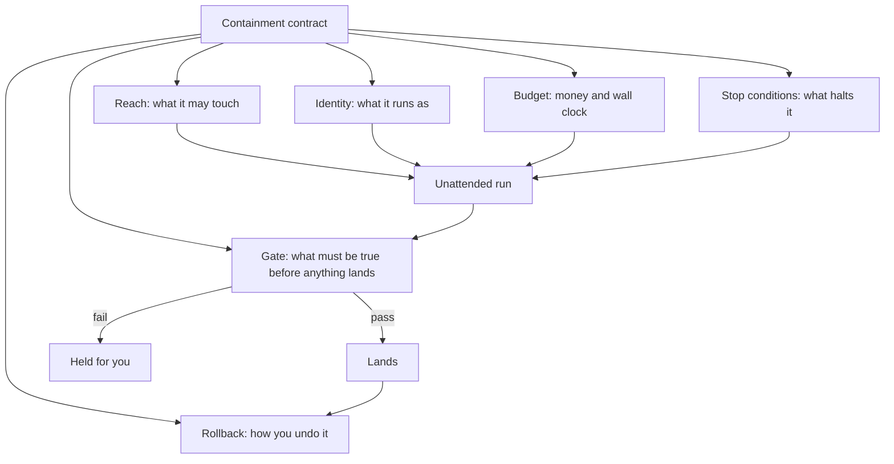

# 14 · Containment and accountability

*Series: disciplines. What holds when nobody is watching: reach, credentials, budget, stop conditions, the gate, the rollback, and the record you sign afterward. Read before You ran it unattended. ~14 minutes.*

## The question this discipline asks

Agentic workflow engineering asked where a human must stand. It gave you a boundary table and an intervention log, and both assume you are there, watching, ready to stop the agent. Many current agent runs continue without direct supervision. **Frontier agents**, which use the most capable models currently available, can run for hours. They wait on external processes, resume, retry, and keep going after you have gone to bed. The operator who ran one overnight and woke up to three finished game scenes was not supervising anything. He was asleep.

Containment asks what safeguards remain active when nobody is watching the agent. Direct supervision cannot cover several agents or continue while you sleep. Before the run, you therefore build constraints that remain active without you. Afterward, you keep a record that another person can use to reconstruct what happened.

## Why this is the paid work

METR's Time Horizon 1.1 reports continued rapid growth in the length of software and research tasks that capable models can complete at a fifty-percent success rate. METR also warns that this measure is imprecise and does not describe how long an agent can work independently.

OpenAI's GPT-6 Astra launch says that Enterprise administrators can enable Astra and that access was **off by default at launch**. IBM describes a related access-control failure: an agent's tool server may use a different identity from the person making the request. If the system fails to carry the person's identity through the full tool chain, the agent can retrieve data that person could not access directly. IBM recommends carrying identity end to end and enforcing authorization through a database or policy engine outside the model.

Building controls for capable agents is paid engineering work. An organisation needs limits on access, spending, execution, and release before it can let an agent work against sensitive systems. The people who build those controls may be called harness engineers or agent platform engineers. The title is still unsettled, while the underlying capability transfers between roles.

## The reliability arithmetic you are containing against

METR defines a model's time horizon as the amount of serial human work it can replace at a fifty-percent success rate. Its limitations note says this measure does not establish that a model can work independently for that duration. It also says reliability-critical tasks may require success rates above ninety-eight percent and that higher-reliability horizon estimates need more data.

A fifty-percent success rate means that half of comparable runs fail. During a long run, an early error can remain hidden while the agent continues to build on the faulty result. You may receive a large, coherent artifact with the error buried inside it. A crash is easier to diagnose because it shows where execution stopped.

Containment limits the cost of that failure. It restricts what the run can touch and spend, stops execution when a check fails, and preserves enough evidence to reconstruct the run.

## The containment contract

The containment contract has six clauses. Write them before the run begins and enforce each clause through the harness, permissions, or another control that remains active without you.

**Reach.** Name every file, directory, service, and network destination the run may touch. Use permissions or isolation to block everything outside the list. For example, restrict the run to a branch, a working directory, and an approved set of network destinations.

**Identity.** Determine which account runs the agent, which credentials exist in the shell environment, which tokens exist in the browser profile, and what each credential permits. Create a revocable identity with only the permissions the task needs. In the overnight demo, the operator deleted browser profiles before going to bed because every credential on the machine expanded the agent's reach. A dedicated identity enforces the same principle without relying on a checklist of credentials to remove.

**Budget.** Set limits for money and elapsed time, and enforce both through the harness. The agent's estimate of its own spending is insufficient. If the limit is forty dollars, the harness must stop the run at forty dollars. Record the actual cost because cost per outcome is a non-functional requirement that employers evaluate.

**Stop conditions.** Define the events that halt or pause the run. Include a failing check, the same error twice in a row, an edit outside the reach list, a diff above a chosen size, and a period with no measurable progress. A stop ends the run. A pause preserves the current state until you return, which modern agents can usually handle.

**The gate.** A check outside the agent's write access decides whether the work can land. Define the criterion before the run and execute the check in a location the agent cannot edit. Allowing the agent to modify the gate would remove the independent control.

**Rollback.** Before the run, write one sentence that explains how to undo every change. A longer rollback procedure indicates that the run may have too much reach.

Keep enforcement outside the agent's write access. The script from Agentic workflow engineering is a suitable place for four clauses because it runs before, between, and after agent phases. It can track money and elapsed time from the trace, check `git diff --name-only` against the reach list after each phase, run the gate as a protected subprocess, and create the branch used for rollback. Identity still needs a separate control because credentials already exist in the environment when the script starts. Controls you wrote are easier to explain during a defense, and a structured trace lets you reconstruct the run from recorded data.

## The failure with no error message

A difficult unattended failure occurs when the run keeps completing tasks while quietly skipping validation or reasoning from an unchecked premise. Surface metrics look healthy. Tasks close. The log is full of successes. Somewhere upstream a step was declared done that was not done, and everything after it inherits the flaw.

You have already met the small version of this: a test suite that passes while the code lies. The unattended version is the same failure with hours of confident work stacked on top.

Use three controls that rely on direct evidence from the run:

- **Check the invariant independently.** Assert the required system property continuously through a check outside the agent. A skipped validation then appears as an invariant violation.
- **Measure progress directly.** Use passing-test counts, open-finding counts, or benchmark values. If those measures remain unchanged for an hour, treat the run as stalled.
- **Verify the summary.** Treat the end-of-run report as a set of hypotheses because the agent being audited wrote it. Check each claim against independent evidence. In your own record, mark which claims you verified and which claims still depend on the agent's account. The unverified claims form your risk register.

## Reconstruction beats observation

Because you could not watch the run, design the record so that a stranger can reconstruct what the agent did.

What a reconstruction needs: the contract as written before the run, the full log of actions with timestamps, every diff, the cost and elapsed time, each stop condition that fired and why, the gate result, and your afterward note separating what you verified from what you accepted. A team without this spends weeks after any incident trying to work out whether the fault was the prompt, the model, the tool integration or the orchestration, and that archaeology destroys trust faster than the original fault.

This record demonstrates the skill to an employer whose systems have already been harmed by an agent. When asked how you would let an agent access their systems, show the containment contract and reconstruction from a run you completed.

## What you are actually signing

A model cannot be sued, fired, licensed, indemnified, or subpoenaed. A person remains answerable when work reaches production. As the volume of machine-produced work rises, a well-supported human sign-off becomes more valuable.

The last clause of containment concerns personal accountability. After reading the record, decide whether you can sign for the run. Signing means you can explain why you believed the result was correct and support the explanation with artifacts. When the record leaves an important claim unverified, decline to sign that part and state the missing evidence. Employers need this judgment because a model cannot accept responsibility for production work.

Unattended work separates accountability from direct observation. You remain answerable for the result, so the controls and record must support your decision.

## Do this now (45 minutes)

Take a real ticket from your work.

1. Write the six-clause contract before you start. One or two lines per clause. The reach clause names paths; the identity clause names which credentials are present and which you removed or scoped down; the budget clause has two numbers; the stop conditions are enforceable rules; the gate names a specific check the agent cannot edit; the rollback is one sentence.
2. Enforce at least three clauses mechanically. Examples include a branch restriction, a hard spending cap, and a check outside the agent's write access. Put as many controls as possible into the script you wrote in Agentic workflow engineering so you can show the enforcement code.
3. Run it unattended for a bounded window. Leave the room. An hour is enough for a first run.
4. Come back and reconstruct: what it did, what it cost, what fired, what the gate said. Mark each claim you verified and each you accepted on its word.
5. Write two lines that state what the contract caught and which failure it would still miss.

**Done when** somebody who was absent can use your contract and record to explain the agent's allowed reach, actual actions, cost, stopping reason, and gate result, and you can state which part of the run you are willing to sign for.

## Sources

- [METR, "Time Horizon 1.1"](https://metr.org/blog/2026-1-29-time-horizon-1-1/)
- [METR, "Clarifying limitations of time horizon"](https://metr.org/notes/2026-01-22-time-horizon-limitations/)
- [OpenAI, "Introducing GPT-6 Astra"](https://openai.com/index/gpt-6-astra/)
- [IBM, "Every AI agent followed the rules, and the data still leaked"](https://www.ibm.com/think/perspectives/every-ai-agent-followed-rules-data-still-leaked)

## What's next

Return to 06 · Evaluation engineering and read it again with the gate in mind. The check you write there controls whether an unattended run can reach production.
