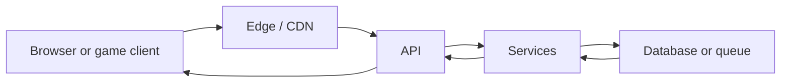

# 15 · How a system runs, end to end

*Series: disciplines. Learn where code runs, what a request costs, and how to map the machines in an existing system. Read this before choosing a project. About 12 minutes.*

## What a tap actually is

When a player taps a button in World, a data packet leaves the player’s device, crosses a network, and reaches a rented machine. That machine may ask another machine for data before answering. The player experiences one tap, while you must account for five or six separate events. Each event adds waiting time, cost, and a possible failure. You need to name the machines before you can specify or verify a change and choose the technology that runs them. For that reason, complete this reading before choosing a project.

Draw the request path from left to right. A content delivery network, or CDN, serves content near the user. An application programming interface, or API, defines how one program asks another for data or work. The same general shape appears in every web system:

Each box represents a place where code runs, stored information lives, or both. Each arrow represents communication that takes time and can fail. To take responsibility for a system, you must be able to name every box.

## Four places where code runs

Code on the **client** runs on the user’s machine, so the user supplies the computing power and can inspect or change the data. Put rendering and responsive interaction on the client. Keep authoritative rules, such as whether money changed hands, on the server. World currently accepts every position reported by a client. The ticket board lists that behavior as an inherited defect because a user controls the client.

Code at the **edge** runs on a content delivery network, or CDN, or on a worker near the user. Edge code is fast and inexpensive, but it sees only the current request and cached data. A cache stores a previous answer for reuse. Use edge code to serve a file or check a token. Keep authoritative facts, such as who owns an item, on the server.

Code on the **server** costs money by the hour or by the request. Server code can access the database, secrets, and other services, so every authoritative decision must reach the server. **Batch** code runs server work later through a scheduled job or a program that consumes queued tasks. Because batch work finishes after the original request, you must check that it actually completed.

The live World at `play.gridschool.org`, which you opened as Stage, is small enough to show the full path. CloudFront serves a Unity WebGL client. A WebSocket server runs on an Amazon Lightsail machine. The system has no database, so restarting the server process removes every player from memory. Include the missing database in your drawing because a useful system map records missing parts as well as existing machines.

## Cost, latency, and the question of what breaks first

The user supplies client computing power, while you pay for server computing power. **Latency** is the time a user waits while data crosses the arrows. A cache returns a stored answer faster than the system can produce a current answer, so using a cache requires deciding how old each fact may be. A player’s display name may tolerate old data, while a gold balance may not. **Load** describes the work created as the number of users grows. When ten players become one hundred, likely bottlenecks include the connection table in one process, a shared file, a slow database query, or a host sized only for a demonstration. The programming language is rarely the first bottleneck.

Your map is incomplete until it predicts which part will fail first with ten times as many users. A request-path drawing alone describes only normal operation.

## The suspicion threshold

This week, learn to inspect a running system or an agent’s proposal and identify where each piece of code runs, where authoritative data lives, which boundary an attacker would test first, and which machine creates cost. With that knowledge, you can write a specification for the correct machine, detect a pull request that moved authority to the client, and explain a technology choice to the person paying for it.

## Do this now (40 minutes)

Draw World as it currently runs. Include the Unity WebGL client, CloudFront, the WebSocket server on Lightsail, and the database that does not exist. For each existing box, name its host. Write one sentence explaining what disappears when the server process restarts. On the same page, predict the first bottleneck at ten times the current number of users. Make the prediction specific enough for another person to test.

For the second drawing, use the provided toy-shop starter. The toy shop has a browser page, a CDN serving static files, one application programming interface process, and a SQLite file on the same host as that process. Draw those four boxes, state where the code and stored information live, and name at least one paid service.

Wait until reading 23 to use the project menu. For this assignment, draw machines that already run.

## Done when

the World fields name the Unity WebGL client, CloudFront, the WebSocket server on Lightsail, the missing database, and the state lost during a restart; the toy-shop field names its browser, CDN, API, SQLite file, code location, stored information, and one paid service; and both ten-times fields name a specific bottleneck and explain why it would fail first.

## What's next

Next, reading 16 introduces five ideas shared by user-interface frameworks and asks you to find them in a component you did not write.
