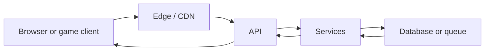

# 15 · How a system runs, end to end

*Series: disciplines. Where code actually runs, what a request costs, and why the first thing you draw for any project is the map of its machines. Read before you pick a project. ~12 minutes.*

## What a tap actually is

When a player taps a button in the world, the thing that happens is not "the app does something." A packet leaves a device you do not control, crosses a network you do not control, and arrives at a machine you rent by the hour, which may in turn ask another machine for a fact before it can answer. The tap feels like one event to the player, and it is five or six to you, each with its own latency, its own bill, and its own way of failing. Until you can name those machines you cannot specify a change to them, you cannot verify one, and you cannot honestly choose the stack that runs them, which is why this reading comes before the project and not after it.

Draw the path left to right and you will see the shape every web system shares, whatever the logos on it.

Each box is a place where code runs, or where state lives, or both, and each arrow is a place where time is spent and things go wrong. The habit this reading is trying to install is that a box you cannot name is a box you cannot own, and the review will ask you to name every one on your own project.

## Four places code runs, and why they are not interchangeable

Code on the **client** runs on the user's machine, which means it costs you nothing and can be trusted with nothing. The user can read every byte you send, change any value before it comes back, and lie to you about their position, their inventory, or whether they paid, so the client is where you put rendering and responsiveness and never where you put the rule that says money changed hands. The world today believes whatever position a client reports, and that is one of the inherited defects on the ticket board precisely because it violates this line.

Code at the **edge**, on a CDN or a worker near the user, is cheap and fast and sees only the request in front of it plus whatever it has cached. It is a good place to serve a file or check a token and a bad place to decide who owns an item, because a cache is by definition an old answer that you have agreed to believe for a while.

Code on the **server** is the code you pay for by the hour or by the request, and it is the only code that can see the database, the secrets, and the other services, which is why every authoritative decision has to end up there whether or not that is convenient. Code in **batch**, a cron job or a queue consumer, is the same as the server but later, and the thing people forget about later is that you have to go back and check that it happened.

The world you will join makes all of this unusually visible because it is so small: a Unity WebGL client served from CloudFront, a WebSocket server on a Lightsail box, and no database at all. That is a complete system. It is also a system that forgets every player the moment the process restarts, and when you draw it the missing database should appear on the page as loudly as the boxes that exist, because absence is the part of a map that agents and new engineers most reliably skip.

## Cost, latency, and the question of what breaks first

Two sentences decide more architecture than any framework comparison: client compute is free to you, and server compute is yours. Every design pressure follows from them. Latency is the time the user spends waiting on the arrows, and a cache exists because an answer that might be slightly wrong can be returned faster than an answer that is definitely right, so choosing a cache is choosing how much staleness a given fact can tolerate, which is a very different question for a player's display name than for their gold balance. Load is what happens when ten players become a hundred, and the first thing that gives way is almost never the programming language; it is the connection table on the single process, the file that everyone writes to, the query that was fine when the table was small, or the host that was described as "fine for a demo" by someone who has left.

If you cannot say which of those breaks first at ten times the users, you do not yet have a map. You have a drawing of the happy path, and the happy path is the one part of a system that never needs an engineer.

## The suspicion threshold

You are not being asked to become a cloud architect this week. You are being asked to reach the point where you can look at a running system, or an agent's proposal for one, and say which box each piece of code runs in, which box holds the truth, which trust boundary you would attack first, and which box sends you a bill. That is enough to write a spec that names the right machine, to review a pull request that quietly moved authority to the client, and to refuse a stack you could not explain to the person paying for it.

## Do this now (40 minutes)

Draw the world as it actually runs: client, CDN, WebSocket server, and the database that is not there, with the host of each named and one sentence on what dies when the process restarts. Then draw the menu project you expect to pick, even if you have not committed to it, using the boxes you expect to need and at least one you will pay for. On both drawings write the first thing that breaks at ten times the users, and make the sentence specific enough that someone could prove you wrong.

## Done when

A stranger can open the two drawings and point at where code runs, where state lives, and what you pay for, and your 10x sentence names a bottleneck rather than a technology.

## What's next

16 · Front-end foundations: the same five ideas under every UI framework, so the name on the repo stops being a barrier.
