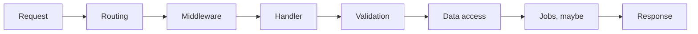

# 17 · Back-end foundations, framework-agnostic

*Series: disciplines. Follow one request lifecycle through .NET, Spring, Express, FastAPI, and Rails. About 12 minutes.*

## The other end of the packet

After the front end sends a request, a server program decides what the request may do. The server finds the code assigned to the path, runs checks shared by many requests, validates the input, reads or changes data, schedules any work that should happen later, and sends a response. Mature server frameworks implement this sequence under different names. Once you can trace the sequence through an unfamiliar system, you can transfer that skill to another framework.

## One shape in five dialects

Use this table as a reference. If an agent gives you a Spring controller after you have worked only with Express, the table helps you find validation, where a database transaction begins and ends, and the framework’s error behavior.

An object-relational mapper, or ORM, converts between database rows and program objects. Structured Query Language, or SQL, is the language used to query a relational database. The table also uses common framework names that you can look up when you encounter them.

| Box | .NET | Spring | Express / Fastify | FastAPI / Django | Rails |
|---|---|---|---|---|---|
| Routing | endpoint / controller | `@RequestMapping` | `app.get` | path operation / urlconf | routes + controller |
| Middleware | filter / middleware | filter / interceptor | middleware | dependency / middleware | rack / before_action |
| Injection | DI container | `@Autowired` | you pass it in | `Depends()` | implicit, which is its own lesson |
| Validation | data annotations / Fluent | Bean Validation | schema / zod | pydantic / forms | strong params + validations |
| Data | EF / Dapper | JPA / JDBC | any client | ORM or SQL | ActiveRecord |
| Jobs | hosted service / hangfire | `@Scheduled` / queue | worker process | celery / rq | ActiveJob |

Rows with no direct counterpart often reveal the most. Express expects you to pass dependencies directly and provides no built-in dependency-injection system. Rails connects many parts implicitly, so a newcomer must learn where each value comes from. Treat these as framework behavior you need to locate.

## The world's request, walked once

The World server uses WebSockets for gameplay, and the same request lifecycle still applies. Accepting a WebSocket routes the connection to a handler. The server decodes each incoming message by type and runs the matching handler. World has no validation step for player position, so the server stores any position sent by the client. The ticket board calls this inherited defect “trusting the client.” Updating in-memory state is the data-access step because World has no database. Broadcasting the new position to other clients is the response. Record these steps for World and for a starter application in an unfamiliar framework. Your comparison should make the missing validation step visible.

Stage is the shared client. The packet you are tracing leaves that client, crosses CloudFront, and lands on the Lightsail process. You do not need your own server to walk that path.

## ORMs, SQL, and work that should not block the answer

An ORM can hide a database join that you need to inspect. Raw SQL exposes the query but can duplicate object mapping across several call sites. Choose based on the query in front of you, and switch approaches when the hidden cost becomes a problem. Reading 22 provides vocabulary for making that request precisely.

A background job performs work after the server sends its response. Sending email, generating a thumbnail, or notifying another service inside the request handler makes the user wait and lets those operations delay or fail the response. Record the choice to run such work inside the handler as a load decision in the specification.

## Do this now (45 minutes)

Trace one request through the World server from WebSocket acceptance to broadcast. Record every lifecycle step, including the missing validation step. Then open a starter application in a server framework you have never shipped and trace `GET /` through the same lifecycle. Create a table that maps each World step to the corresponding step in the unfamiliar framework. Include a row when one system has no counterpart.

Choose a starter application from any server framework you have never shipped. A single `GET /` route is enough for mapping the framework’s lifecycle names.

## Done when

the World field traces socket acceptance, message type, handler, state mutation, and broadcast; the unfamiliar-framework field traces `GET /` through the same lifecycle; and the final field explains which row has no counterpart.

## What's next

18 · Data: a toy migration you can undo, with a row that has to survive both directions.
