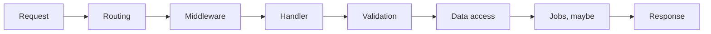

# 17 · Back-end foundations, framework-agnostic

*Series: disciplines. The request lifecycle is one shape in .NET, Spring, Express, FastAPI, and Rails. Learn the shape and the brands become dialects. ~12 minutes.*

## The other end of the packet

The front end sent a request, and now a program on a machine you pay for has to decide what that request is allowed to do, which means finding the code that handles this path, running whatever checks apply to every request before it, validating the input, touching the data, possibly scheduling work that should not hold the response, and answering. Every mature server framework implements that sequence, and once you can walk a request through it on a system you did not write you can walk it through the next one, because the sequence is the thing and the framework is the accent.

## One shape in five dialects

You do not memorise this table. You keep it so that when an agent hands you a Spring controller and everything you have shipped was Express, you can still find where validation happens, where the transaction boundary is, and what the framework does when the handler throws.

| Box | .NET | Spring | Express / Fastify | FastAPI / Django | Rails |
|---|---|---|---|---|---|
| Routing | endpoint / controller | `@RequestMapping` | `app.get` | path operation / urlconf | routes + controller |
| Middleware | filter / middleware | filter / interceptor | middleware | dependency / middleware | rack / before_action |
| Injection | DI container | `@Autowired` | you pass it in | `Depends()` | implicit, which is its own lesson |
| Validation | data annotations / Fluent | Bean Validation | schema / zod | pydantic / forms | strong params + validations |
| Data | EF / Dapper | JPA / JDBC | any client | ORM or SQL | ActiveRecord |
| Jobs | hosted service / hangfire | `@Scheduled` / queue | worker process | celery / rq | ActiveJob |

The row that teaches the most is usually the one where a framework has no clean counterpart. Express has no dependency injection because it expects you to pass things in by hand, and Rails has so much implicit wiring that the question "where is this coming from" is the first thing a newcomer learns to ask. Neither of those is a flaw you need to fix. They are facts you need to be able to find.

## The world's request, walked once

The world server does not speak HTTP for gameplay, and that makes it a better first trace, not a worse one, because the boxes are still there without the familiar names. A WebSocket is accepted, which is routing in the sense that this connection now belongs to this handler. A message arrives and is decoded by type, which is the router's second job. The handler for that type runs, and here the world is missing a box: there is no validation, so the server writes whatever position the client sent into its state, which is the inherited defect the ticket board calls trusting the client. The state mutation is the data access step, in memory because there is no database, and the broadcast to other clients is the response. When you write those boxes down for the world and then for a hello-world in a framework you have never used, the mapping table falls out of the comparison, and the missing validation box is the kind of row that ends up in a spec.

## ORMs, SQL, and work that should not block the answer

An object-relational mapper is a convenience that will eventually hide a join you needed to see, and raw SQL is a power that will eventually hide a mapping you needed to keep consistent across three call sites. Neither is the right answer in general. The skill is knowing which of those two lies you are living with on the query in front of you and being able to ask for the other one when the query becomes the problem, which is exactly the kind of request you will make to an agent by name once you have the vocabulary from reading 22.

Background jobs exist because some work should not sit on the request path. Sending an email, generating a thumbnail, notifying another team's service: if your handler does those inline, the user waits for them and your response time inherits their failures, so a handler that does that work inline is a load decision wearing a feature's clothes, and it belongs in the spec as one.

## Do this now (45 minutes)

Trace one request through the world server from socket accept to broadcast and write the boxes, including the one that is missing. Then open a hello-world in a server framework you have not shipped and trace `GET /` through the same names. Write the mapping table from world box to foreign box, and make sure the row with no counterpart is on it rather than quietly dropped.

## Done when

The mapping table exists at a public URL and a stranger could follow one world request and one foreign request through the same lifecycle names, including the box the world does not have.

## What's next

18 · Data: what you keep, how it moves, and why the rollback is part of the write.
